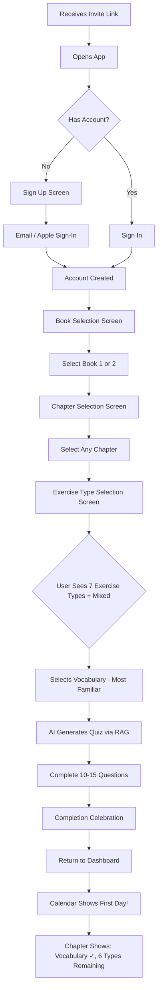
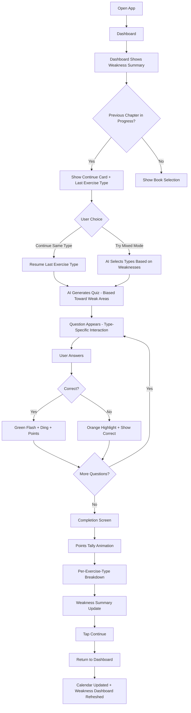
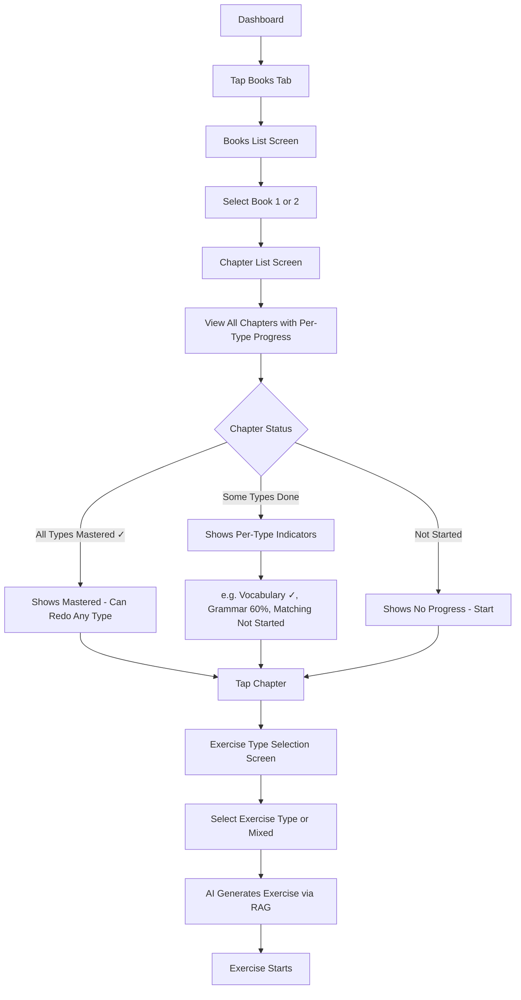
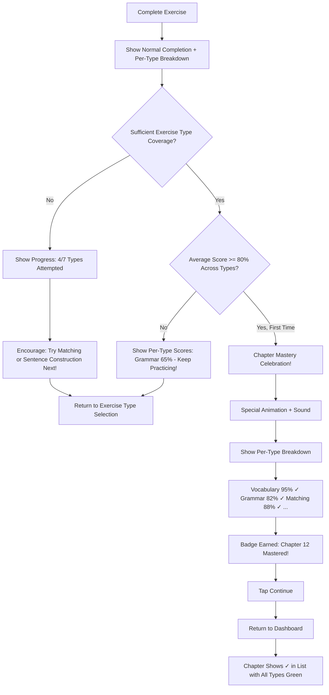
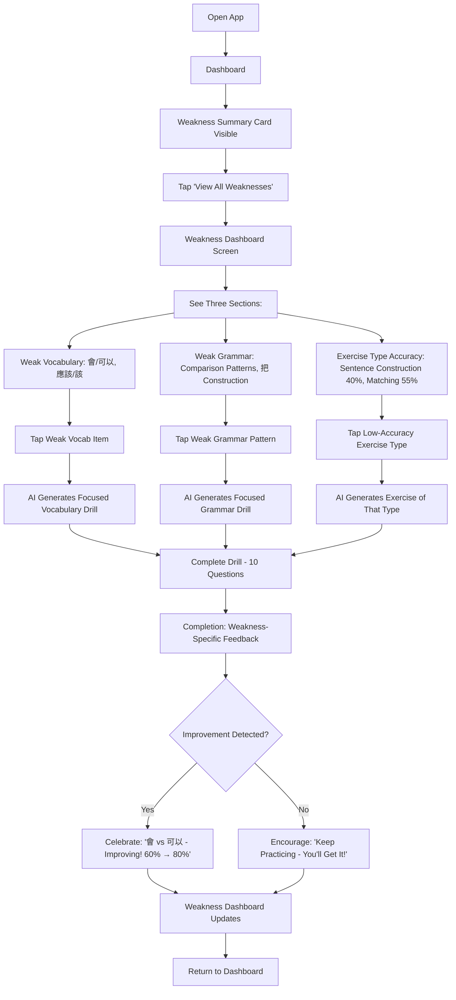

# UX Design Specification dangdai-app

**Author:** Maxime
**Date:** Sat Feb 14 2026 (Updated: Thu Feb 20 2026)

---

## Executive Summary

### Project Vision

A gamified mobile app enabling NTNU 當代中文課程 (Dangdai) alumni to continue their Chinese studies anywhere in the world. The app mirrors the exact curriculum structure - same vocabulary, grammar patterns, and chapter progression - that users already learned in Taiwan, delivered through a Duolingo-style mobile experience.

**Core Value Proposition:** "Continue your NTNU Chinese journey, anywhere in the world."

### Target Users

**Primary Users (MVP):** 5 friends who studied Chinese at NTNU Taiwan
- Familiar with Dangdai textbook structure and content
- Want to maintain Chinese skills after leaving Taiwan
- Seek short, engaging sessions (15+ minutes, 3x/week)
- Looking for familiar content that mirrors classroom experience

**Growth Target:** 100 NTNU alumni within 12 months

### Key Design Challenges

1. **Quiz Experience Flow** - Making AI-generated quizzes feel seamless and responsive despite 5-second LLM generation time. Clear loading feedback and smooth question transitions are essential.

2. **Progress Clarity Across Multiple Dimensions** - Users track chapter %, book progress, streaks, points, and quiz history. Must present without overwhelming while making "continue where I left off" instant.

3. **Chinese Character Display & Interaction** - Handling character/pinyin/meaning relationships clearly across question types. Mobile typography and readability for Chinese characters is critical.

4. **Motivation for Small User Group** - MVP gamification (streaks, points) must drive 3x/week engagement among 5 friends without Phase 2 social features.

5. **Exercise Type Selection UX** - Users need to choose from 7 exercise types per chapter (Vocabulary, Grammar, Fill-in-the-Blank, Matching, Dialogue Completion, Sentence Construction, Reading Comprehension, or "Mixed") without feeling overwhelmed. The selection UI must communicate per-type progress at a glance and guide users toward uncovered or weak areas without being prescriptive.

6. **Weakness Dashboard Presentation** - Presenting learner weakness data (missed vocabulary, low-accuracy grammar patterns, weak exercise types) in a motivating, non-judgmental way. The dashboard must encourage targeted practice without making users feel bad about their gaps. Data framing matters: "improving" > "failing," "focus area" > "weakness."

### Design Opportunities

1. **Familiar Curriculum = Reduced Cognitive Load** - Users know Dangdai structure from NTNU. UX can leverage this familiarity - "pick up where you left off" feels like returning to class, not learning a new app.

2. **Micro-Session Optimization** - Design for 15-minute commute/break sessions. Quick launch → immediate quiz → visible progress → satisfying close.

3. **Celebration & Momentum** - Strong visual feedback for correct answers, chapter completion, and streak milestones creates emotional hooks that keep the friend group engaged.

## Core User Experience

### Defining Experience

The core experience is the **exercise interaction loop**: select exercise type → answer questions with type-specific interactions → immediate feedback → weakness-aware summary. This is what users will do most frequently and must feel polished and satisfying.

**Core Loop:**
1. User selects exercise type for a chapter (or "Mixed" for adaptive variety)
2. AI generates questions from RAG-retrieved textbook/workbook content filtered by exercise type
3. User interacts with type-specific question format:
   - **Vocabulary / Grammar / Reading Comprehension:** Multiple choice (tap answer from 2x2 grid or vertical list)
   - **Fill-in-the-Blank:** Select word from horizontal scrollable word bank, or type answer
   - **Matching:** Tap-to-pair interaction connecting related items (character ↔ pinyin, question ↔ response)
   - **Dialogue Completion:** Read conversation bubbles, select appropriate response to fill the blank
   - **Sentence Construction:** Drag/tap word tiles to reorder into correct sentence
4. Instant feedback with sound + animation (correct/incorrect) — consistent across all types
5. Points animate upward
6. Next question or completion celebration
7. Post-quiz: weakness summary updates ("You struggled with: 會 vs 可以"), feeds into future adaptive quizzes

### Platform Strategy

| Aspect | Decision |
|--------|----------|
| Framework | React Native + Expo |
| UI Library | Tamagui (performant, cross-platform styling) |
| Design Style | Playful like Duolingo, but simpler to implement |
| Connectivity | Online-only (LLM quiz generation requires internet) |
| Primary Input | Touch-based mobile interaction |

### Effortless Interactions

- **Continue learning** - One tap from dashboard to resume current chapter quiz
- **Answer questions** - Large, tappable answer options with clear touch feedback
- **Track progress** - Glanceable dashboard shows streak calendar + chapter progress without navigation

### Critical Success Moments

1. **First correct answer** - Sound + animation confirms "this works"
2. **Exercise completion** - Points visibly tally up with satisfying animation
3. **Calendar day filled** - GitHub-style grid shows today's activity, building streak visibility
4. **Chapter mastery** - Clear celebration when reaching 80%+ on chapter

### Experience Principles

1. **Playful but achievable** - Duolingo-inspired fun without over-engineering complexity
2. **Satisfying feedback loops** - Every correct answer rewards with sound + animation
3. **Visual progress is motivating** - GitHub-style activity calendar makes consistency visible
4. **Quick to value** - Minimal taps from launch to learning
5. **Familiar structure** - Dangdai curriculum structure users already know reduces cognitive load

## Desired Emotional Response

### Primary Emotional Goals

Users should feel these core emotions when using dangdai-app:

1. **Accomplished** - "I'm actually learning and making real progress with my Chinese"
2. **Nostalgic** - "This feels like being back in NTNU class with familiar content"
3. **Playful/Fun** - "This doesn't feel like studying, it's enjoyable"
4. **Motivated** - "I want to come back and do more"

**Share-worthy moment:** "This app is fun AND it uses our NTNU books!" - the combination of enjoyment + familiar curriculum is what makes users tell friends.

### Emotional Journey Mapping

| Stage | Desired Emotion |
|-------|-----------------|
| Opening app | Welcomed, ready to learn |
| During quiz | Engaged, playful, focused |
| Correct answer | Small burst of satisfaction |
| Wrong answer | Encouraged ("nice try"), not shamed |
| Session complete | Productive, accomplished |
| Viewing progress | Proud of consistency |
| Missed days | No guilt - focus on weekly/monthly totals |

### Micro-Emotions

**Prioritize:**
- Confidence over confusion (clear UI, familiar structure)
- Accomplishment over frustration (gentle feedback)
- Delight over mere satisfaction (sounds, animations)
- Encouragement over pressure (activity count vs streak guilt)

**Avoid:**
- Anxiety about breaking streaks
- Shame for wrong answers
- Guilt for missed days
- Overwhelm from too much information

### Design Implications

| Emotional Goal | UX Design Approach |
|----------------|-------------------|
| Accomplished | Points animation, chapter % progress, GitHub-style calendar |
| Nostalgic | NTNU Dangdai structure, familiar vocabulary/grammar |
| Playful/Fun | Sounds, animations, celebratory feedback |
| Motivated | Weekly/monthly activity count (not consecutive streaks) |
| Encouraged (on failure) | Gentle wrong answer feedback, no red X shame |
| Productive (post-session) | Clear summary of what was accomplished |

### Emotional Design Principles

1. **Celebrate effort, not perfection** - Activity frequency matters more than perfect streaks
2. **Gentle failure** - Wrong answers encourage retry, not discourage
3. **Nostalgia as comfort** - Familiar NTNU structure reduces anxiety
4. **Fun is productive** - Playful design doesn't diminish learning value
5. **No guilt mechanics** - Weekly/monthly counts replace streak pressure

## UX Pattern Analysis & Inspiration

### Inspiring Products Analysis

#### Duolingo
**What they do well:**
- Quiz flow with smooth transitions between questions
- Immediate answer feedback with satisfying sounds/animations
- Clear progress visualization (XP, levels, completion %)
- "Words you struggled with" summary after lessons
- Sound design that celebrates without being annoying
- Bite-sized lesson structure (5-10 min sessions)

**What to avoid:**
- Aggressive streak guilt messaging
- Excessive notifications/nagging
- Hearts/lives system that punishes mistakes
- Heavy upsell pressure for premium

#### Noji (formerly Noji Pro)
**What they do well:**
- Clean, calming visual aesthetic
- Satisfying micro-interactions and animations
- Simple, clear data visualization
- Non-judgmental tracking approach
- Minimal UI that doesn't overwhelm

### Transferable UX Patterns

**From Duolingo:**
| Pattern | Application to dangdai-app |
|---------|---------------------------|
| Quiz flow | Smooth question → answer → feedback → next loop |
| Answer feedback | Sound + animation for correct/incorrect |
| Progress visualization | Chapter %, points, activity calendar |
| Weak area summary | "You struggled with 會 vs 可以" post-quiz |
| Lesson structure | 10-15 question exercises, chapter-based |

**From Noji:**
| Pattern | Application to dangdai-app |
|---------|---------------------------|
| Clean aesthetic | Playful but not cluttered |
| Micro-interactions | Subtle, satisfying animations throughout |
| Non-judgmental tracking | Weekly/monthly counts, no guilt |
| Simple visualization | GitHub-style calendar, clear progress bars |

### Anti-Patterns to Avoid

1. **Streak guilt** - No "You'll lose your streak!" pressure messaging
2. **Punishment mechanics** - No hearts/lives that limit learning
3. **Notification spam** - Minimal, respectful reminders only (Phase 2)
4. **Cluttered UI** - Keep screens focused, avoid feature overload
5. **Shame on failure** - Wrong answers encourage, not discourage

### Design Inspiration Strategy

**Adopt Directly:**
- Duolingo quiz flow (question → feedback → next)
- Duolingo sound design approach (celebratory, not annoying)
- Duolingo weak area summary
- Noji clean aesthetic and micro-interactions
- Noji non-judgmental tracking philosophy

**Adapt for dangdai-app:**
- Duolingo progress → Simplify to chapter % + GitHub calendar
- Duolingo lesson structure → Map to Dangdai chapters/vocabulary
- Noji minimal UI → Add playfulness while keeping clarity

**Explicitly Avoid:**
- Duolingo streak guilt mechanics
- Duolingo hearts/lives system
- Duolingo aggressive notifications
- Over-gamification that distracts from learning

## Design System Foundation

### Design System Choice

**Primary UI Library:** Tamagui

Tamagui provides a performant, themeable foundation for React Native + Expo that aligns with dangdai-app's need for a playful, custom aesthetic with smooth animations.

### Rationale for Selection

| Requirement | How Tamagui Addresses It |
|-------------|-------------------------|
| Playful aesthetic | Fully themeable, not locked to Material Design |
| Performance | Compiles to native, optimized for animations |
| Expo compatibility | First-class Expo support |
| Custom look | Strong theming system for brand customization |
| Animation support | Works with @tamagui/animations for quiz feedback |

### Implementation Approach

**Foundation Layer:**
- Tamagui core components (Button, Card, Text, Stack, etc.)
- Custom theme with playful color palette
- Typography scale optimized for Chinese characters

**Custom Components (to build):**
- Quiz question/answer cards
- Progress bar with animation
- Points counter with tally animation
- GitHub-style activity calendar
- Correct/incorrect feedback overlays

**Animation Strategy:**
- `@tamagui/animations-moti` (Reanimated-based driver) for all Tamagui component animations
- Declarative `enterStyle`/`exitStyle`/`pressStyle` props on components with named animation presets (`quick`, `bouncy`, `medium`, `slow`)
- `AnimatePresence` for quiz question transitions, feedback overlays, and completion screens
- Raw Reanimated `useSharedValue`/`withTiming` only for numeric count-up animations (points counter)
- Sound integration via expo-av, triggered alongside animation events

### Customization Strategy

**Theme Customization:**
- Define playful color tokens (primary, success, error, etc.)
- Create custom spacing and radius for rounded, friendly feel
- Typography tokens for Latin and Chinese character display

**Component Customization:**
- Extend Tamagui primitives for quiz-specific components
- Build reusable feedback patterns (correct/incorrect states)
- Create consistent touch targets for mobile quiz interaction

### Sub-Theme Strategy

Tamagui sub-themes use the `parentTheme_subTheme` naming convention (e.g., `light_primary`, `dark_primary`). Wrapping any component tree in `<Theme name="primary">` automatically remaps all semantic tokens (`background`, `color`, `borderColor`, etc.) to the sub-theme values. This is the primary mechanism for creating distinct visual contexts without one-off styling.

**Required Sub-Themes:**

| Sub-Theme | Purpose | Usage |
|-----------|---------|-------|
| `primary` | Primary action surfaces | CTA buttons, active tab indicators, selected states |
| `success` | Correct answer context | FeedbackOverlay (correct), completion celebrations, mastery badges |
| `error` | Incorrect answer context | FeedbackOverlay (incorrect), error states |
| `warning` | Caution/hint context | Quiz hints, network warnings |

**Usage Pattern:**

Instead of manually setting `backgroundColor="$success"` and `color="$successText"` on individual elements, wrap the subtree:

```tsx
<Theme name="success">
  <FeedbackOverlay /> {/* Automatically gets success background, text, border */}
</Theme>
```

This ensures consistent color relationships (background + text contrast, border coordination) and simplifies dark mode -- each sub-theme has both `light_success` and `dark_success` variants that are resolved automatically.

**Sub-Theme Values (example for `light_primary`):**
- `background`: `#06B6D4` (primary color becomes the background)
- `backgroundHover`: `#0891B2`
- `backgroundPress`: `#0891B2`
- `color`: `#FFFFFF` (white text on teal)
- `borderColor`: `#06B6D4`

## Defining Experience

### Core Interaction

**One-sentence description:** "A cool app that feels like a game but to continue learning Taiwan Chinese in the NTNU books where you left it."

**Defining experience:** Pick an exercise TYPE (or "Mixed"), complete an AI-generated workbook-style exercise built from the actual Dangdai textbook/workbook content via RAG, and see your per-type mastery grow across the chapter.

The satisfaction comes from seeing **multiple exercise types mastered per chapter**, not just one quiz score. Each type completed fills in another piece of the chapter mastery puzzle. Individual correct answers are small wins; completing an exercise type is a medium win; full chapter coverage across types is the big payoff.

### User Mental Model

**Background from NTNU:**
- Users learned through: class with teacher + textbook → workbook exercises
- The app serves as a **digital workbook** with gamification
- Familiar structure reduces learning curve

**User expectations:**
- Exercise = set of 10-15 related questions of a specific type (like a workbook page section)
- Multiple exercise types per chapter mirror the variety in the physical workbook
- "Mixed" mode = AI picks the best exercise types based on what you need to practice
- Completion = satisfying moment of accomplishment per exercise type
- Progress = visible per-type coverage, cumulative, non-judgmental

### Success Criteria

| Criteria | What Success Looks Like |
|----------|------------------------|
| Exercise type completion | Clear celebration moment with sound + animation per exercise type |
| Chapter coverage | User sees per-type progress indicators filling up (Vocabulary done, Grammar 60%, Matching not started) |
| Progress visibility | Calendar fills up, points tally animates, per-type mastery grows |
| Session satisfaction | User feels productive after 15 minutes across different exercise types |
| Weakness improvement | User sees weakness areas shrinking over time |
| Return motivation | "I want to master more exercise types" and "I want to improve my weak areas" |

### Pattern Analysis

**Established Patterns (users already know):**
- Workbook exercise structure (from NTNU experience)
- Quiz question/answer format (familiar from any learning app)
- Progress tracking (familiar from fitness/habit apps)

**Our Unique Twist:**
- Gamified workbook (sounds, animations, points on completion)
- NTNU-specific content (nostalgia + curriculum familiarity)
- Guilt-free progress tracking (weekly/monthly counts, not streaks)

### Experience Mechanics

**1. Exercise Type Selection:**
- User taps "Continue" or selects chapter → arrives at Exercise Type Selection screen
- Sees grid of exercise type cards (Vocabulary, Grammar, Fill-in-the-Blank, Matching, Dialogue Completion, Sentence Construction, Reading Comprehension) plus "Mixed" option
- Each card shows per-type progress (e.g., "80%", "Not started", checkmark for mastered)
- User taps an exercise type (or "Mixed" for AI-selected adaptive variety)
- AI generates exercise from RAG-retrieved content filtered by chapter + exercise type

**2. Interaction (Tamagui `AnimatePresence` pattern):**

Each question is rendered inside `AnimatePresence` with `key={questionIndex}`. When the index changes, the current question animates out and the next animates in:

```tsx
<AnimatePresence custom={{ direction }}>
  <QuizQuestionCard
    key={questionIndex}
    animation="medium"
    enterStyle={{ opacity: 0, x: 20 }}    // slides in from right
    exitStyle={{ opacity: 0, x: -20 }}     // slides out to left
  />
</AnimatePresence>
```

**Type-specific interaction patterns:**

- **Vocabulary / Grammar / Reading Comprehension:** Question appears with slide-in → user taps answer from multiple choice grid → immediate feedback
- **Fill-in-the-Blank:** Sentence with blank displayed → horizontal scrollable word bank below → user taps word to fill blank (or types answer) → feedback
- **Matching:** Two columns displayed (e.g., characters left, pinyin right) → user taps item in left column, then taps matching item in right column to pair → matched pairs animate together with `<Theme name="success">` → incorrect pairs shake with `animation="quick"` and reset
- **Dialogue Completion:** Conversation bubble layout (A/B alternating) with one blank bubble → user selects response from options below → selected response fills the blank bubble with slide-in animation
- **Sentence Construction:** Scrambled word tiles displayed in a tappable/draggable row → user taps tiles in order (or drags to reorder) to construct sentence → tiles snap into sentence area → submit to check order

Common across all types:
- Answer options use `pressStyle: { scale: 0.98 }`
- Immediate feedback via `<Theme name="success">` or `<Theme name="error">` wrapping the interaction
- Sound plays simultaneously (correct = ding, incorrect = gentle bonk)
- After 1 second hold, `questionIndex` increments, triggering `AnimatePresence` exit/enter cycle

**3. Feedback (per question):**
- Correct: `<Theme name="success">` on answer + satisfying sound + small point increment visible
- Incorrect: `<Theme name="error">` on answer + gentle sound + correct answer revealed
- FeedbackOverlay uses `AnimatePresence` with `enterStyle: { opacity: 0, scale: 0.8 }` for pop-in
- For matching/sentence construction: partial credit feedback shows which pairs/positions were correct

**4. Completion (the big moment):**
- All questions answered → `CompletionScreen` enters via `AnimatePresence` with `enterStyle: { opacity: 0, y: 50 }` (slides up)
- Points tally up with Reanimated count-up + Tamagui `animation="bouncy"` end-bounce
- **Per-exercise-type breakdown** shown: "Vocabulary: 90%, Grammar: 75%, Matching: 80%"
- "You struggled with: 會 vs 可以" weakness summary fades in with `animation="medium"`
- Weakness profile updates in real-time — feeds into future adaptive quiz generation
- Calendar square fills in for today
- "Exercise complete! +85 points"

## Visual Design Foundation

### Color System

**Brand Color Values:**

| Token | Color | Hex | Usage |
|-------|-------|-----|-------|
| `primary` | Teal/Cyan | `#06B6D4` | Main actions, buttons, highlights |
| `primaryDark` | Deep Teal | `#0891B2` | Pressed states, emphasis |
| `primaryLight` | Light Cyan | `#22D3EE` | Dark mode primary, hover accents |
| `secondary` | Warm Orange | `#F97316` | Accents, points, celebrations |
| `success` | Soft Green | `#22C55E` | Correct answers, completion |
| `error` | Gentle Orange | `#FB923C` | Wrong answers (encouraging, not harsh) |
| `warning` | Amber | `#F59E0B` | Alerts, hints, cautions |

**Tamagui Semantic Theme Tokens (Light Mode):**

Every theme must define the full set of Tamagui semantic tokens with interaction states. These are not arbitrary names -- Tamagui components consume them automatically for `background`, `color`, `borderColor`, etc.

| Token | Value | Purpose |
|-------|-------|---------|
| `background` | `#FAFAF9` | Main screen background |
| `backgroundHover` | `#F5F5F4` | Background on hover |
| `backgroundPress` | `#E7E5E4` | Background on press |
| `backgroundFocus` | `#D6D3D1` | Background on focus |
| `backgroundStrong` | `#E7E5E4` | Emphasized background |
| `surface` | `#FFFFFF` | Cards, elevated surfaces (custom token) |
| `color` | `#1C1917` | Primary text |
| `colorHover` | `#292524` | Text on hover |
| `colorPress` | `#44403C` | Text on press |
| `colorSubtle` | `#78716C` | Secondary/muted text (custom token) |
| `borderColor` | `#D6D3D1` | Default borders |
| `borderColorHover` | `#A8A29E` | Border on hover |
| `borderColorFocus` | `#06B6D4` | Border on focus (uses primary) |
| `placeholderColor` | `#78716C` | Input placeholders |

Each semantic color (`success`, `error`, `warning`) also requires background/border/text variants for contextual UI (e.g., `successBackground: '#DCFCE7'`, `successBorder: '#BBF7D0'`, `successText: '#166534'`).

**Dark Mode:** All tokens are redefined with inverted/adjusted values. Primary shifts to `primaryLight` (`#22D3EE`) for better contrast on dark backgrounds.

**Color Rationale:**
- Teal primary = fresh, modern, calming but energetic
- Orange accents = celebratory, warm (points, rewards)
- Gentle orange for errors = encouraging, not punishing (aligns with emotional goals)
- Soft green for success = satisfying without being harsh
- Interaction state variants (hover/press/focus) ensure consistent feedback across all Tamagui components without manual styling

### Typography System

**Font Families:**

| Type | Font | Fallback |
|------|------|----------|
| Latin (UI) | Inter | SF Pro, system-ui |
| Chinese | System Default | PingFang SC (iOS), Noto Sans CJK (Android) |

**Type Scale:**

| Level | Size | Weight | Usage |
|-------|------|--------|-------|
| Display | 32px | Bold | Celebration screens |
| H1 | 24px | Semibold | Screen titles |
| H2 | 20px | Semibold | Section headers |
| Body Large | 18px | Regular | Quiz questions, Chinese characters |
| Body | 16px | Regular | General text |
| Caption | 14px | Regular | Secondary info, labels |
| Small | 12px | Medium | Badges, metadata |

**Chinese Character Guidelines:**
- Minimum 18-20px for quiz content
- Adequate line height (1.5) for character clarity
- Consider character weight for stroke visibility

### Spacing & Layout Foundation

**Base Unit:** 4px

**Spacing Scale:**

| Token | Value | Usage |
|-------|-------|-------|
| xs | 4px | Tight spacing, inline elements |
| sm | 8px | Related elements |
| md | 16px | Standard spacing |
| lg | 24px | Section spacing |
| xl | 32px | Large gaps |
| 2xl | 48px | Screen padding, major sections |

**Border Radius:**

| Element | Radius |
|---------|--------|
| Buttons, Cards | 12px |
| Small elements | 8px |
| Icons, Avatars | Full (50%) |

**Layout Principles:**
1. **Generous touch targets** - Minimum 48px for tappable elements
2. **Breathing room** - Cards and quiz options have ample padding
3. **Clear hierarchy** - Spacing increases between less related elements
4. **Mobile-first** - Designed for one-handed use

### Accessibility Considerations

- All text meets WCAG AA contrast ratios (4.5:1 minimum)
- Large Chinese characters for readability (18px+ for quiz content)
- Color is never the only indicator (icons + color for correct/incorrect)
- Touch targets minimum 48x48px
- Support for system font scaling

## Design Direction Decision

### Design Directions Explored

Six design direction mockups were created exploring different visual approaches:

1. **Dashboard (Clean)** - Minimal, Noji-inspired with progress ring and card-based layout
2. **Dashboard (Vibrant)** - Bold teal header with stats, more Duolingo-like energy
3. **Quiz Screen** - Question/answer flow with large Chinese characters and 2x2 answer grid
4. **Completion Screen** - Celebration moment with points tally, accuracy stats, and review summary
5. **Progress Focus** - Monthly calendar view with book progress cards
6. **Chapter Selection** - Chapter list with progress states and open navigation

Interactive mockups available at: `_bmad-output/planning-artifacts/ux-design-directions.html`

### Chosen Direction

**Approach:** Hybrid combining elements from multiple directions

**Key Design Decisions:**
- Clean card-based layout (Direction 1) for dashboard clarity
- Vibrant gamification elements (Direction 2) for engagement
- Large-character quiz cards (Direction 3) for readability
- Full-screen celebration (Direction 4) for completion satisfaction
- Monthly calendar with "X days this month" (Direction 5) for guilt-free tracking
- Open chapter navigation (Direction 6) for flexibility

**Theme Support:** Both light and dark mode supported
- Light mode: Off-white background, white cards, teal accents
- Dark mode: Dark gray backgrounds, elevated dark cards, adjusted accent colors

### Design Rationale

| Decision | Rationale |
|----------|-----------|
| Clean + Vibrant hybrid | Balance between Noji calm and Duolingo fun |
| Large Chinese characters | Critical for readability and learning |
| Full-screen completion | Maximizes celebration moment impact |
| Monthly calendar (not streak) | Aligns with "no guilt" emotional goal |
| Dark mode support | Modern app expectation, reduces eye strain |
| Card-based layout | Clear visual hierarchy, familiar pattern |

### Implementation Approach

**Phase 1 (MVP):**
- Implement core screens: Dashboard, Quiz, Completion, Chapter Select
- Light mode first, dark mode as fast-follow
- Focus on quiz feedback animations and sounds

**Component Priority:**
1. Quiz question/answer cards with feedback states
2. Progress ring and progress bars
3. GitHub-style activity calendar
4. Points counter with animation
5. Completion celebration screen

**Theme Implementation:**
- Use Tamagui semantic theme tokens (`$background`, `$color`, `$borderColor`, etc.) for all colors
- `<TamaguiProvider defaultTheme="light">` with system preference detection
- Sub-themes (`light_primary`, `dark_primary`, `light_success`, etc.) for contextual color switching via `<Theme name="...">`
- Manual override option in Settings (stored in Zustand `useSettingsStore`)

## User Journey Flows

### Journey 1: First-Time User (Onboarding)

**Goal:** Get new user from signup to first exercise completion as fast as possible.

**Flow Summary:** Signup → Book Selection → Chapter Selection → Exercise Type Selection → First Exercise → Completion Celebration



**Key Design Decisions:**
- No tutorial/intro - get to learning immediately
- Book/chapter selection is required (no default)
- All chapters accessible from day one
- Exercise type selection screen shows all 7 types + "Mixed" with clear labels and icons
- For first-time users, "Vocabulary" is visually suggested (top-left position, slightly emphasized) as the most familiar entry point
- First completion = first calendar square filled + first exercise type progress indicator filled

**Success Moment:** "Day 1 started! +X points" with calendar visual + "Vocabulary complete! 6 more exercise types to explore"

---

### Journey 2: Daily Quiz Session (Core Loop)

**Goal:** Minimal friction from app open to learning, with adaptive content targeting weak areas.

**Flow Summary:** Open App → Dashboard (with weakness summary) → Continue or Mixed Mode → Adaptive Quiz → Completion with Weakness Update → Dashboard



**Key Design Decisions:**
- Dashboard prominently shows weakness summary: "Focus areas: 會 vs 可以, Sentence Construction (40%)"
- "Mixed" mode available from dashboard — AI generates questions biased toward documented weak areas (30-50% of questions target weaknesses)
- Auto-advance between questions after feedback
- Completion screen shows: points, accuracy, **per-exercise-type breakdown**, and weakness summary
- Weakness dashboard updates in real-time after each quiz completion
- Dashboard updates immediately with new calendar state and refreshed weakness indicators

**Timing:**
- Question feedback: ~1 second display
- Completion animation: ~2-3 seconds
- Total session: ~10-15 minutes for 10-15 questions

---

### Journey 3: Chapter Navigation

**Goal:** Allow flexible navigation to any chapter in any book, with per-exercise-type progress visibility.

**Flow Summary:** Dashboard → Books → Select Book → Chapters (with per-type progress) → Select Chapter → Exercise Type Selection → Exercise



**Key Design Decisions:**
- All chapters visible and accessible (no locks)
- **Per-exercise-type progress indicators** on each chapter list item (e.g., "Vocabulary ✓, Grammar 60%, Matching not started")
- Compact indicator row uses small icons/dots per exercise type with color-coded status (green = mastered, teal = in progress, gray = not started)
- Tapping a chapter goes to Exercise Type Selection, not directly to quiz
- Can redo completed exercise types anytime
- Back navigation always available

---

### Journey 4: Chapter Completion (Mastery)

**Goal:** Celebrate chapter mastery, which now requires coverage across multiple exercise types.



**Key Design Decisions:**
- Chapter mastery requires **coverage across multiple exercise types**, not just a single quiz score
- Completion screen shows **per-exercise-type breakdown** (score per type attempted)
- 80% average across attempted types triggers mastery celebration
- Minimum type coverage threshold before mastery is possible (e.g., at least 4 of 7 types attempted)
- Extra celebration for first-time mastery (not on redo)
- Badge/achievement earned
- Encourages trying uncovered exercise types: "Try Matching next!"
- Return to exercise type selection or dashboard (no auto-prompt for next chapter)

---

### Journey 5: Reviewing Weak Areas

**Goal:** User sees weakness dashboard, identifies specific weak areas, and launches focused drills to improve.



**Key Design Decisions:**
- Weakness dashboard accessible from dashboard summary card (always visible) and from Progress tab
- Three weakness categories: vocabulary items, grammar patterns, exercise type accuracy
- Each weak area is a **tappable action card** that launches a focused drill
- Framing is always positive: "Focus area" not "weakness," "Improving" not "failing"
- Progress bars show improvement over time (last 5 sessions)
- After drill completion, specific improvement feedback: "會 vs 可以: 60% → 80%"
- Weakness data updates in real-time after every completed exercise

---

### Journey Patterns

**Navigation Patterns:**

| Pattern | Usage |
|---------|-------|
| One-tap action | Continue button → Quiz starts |
| Back navigation | Always available, returns to previous screen |
| Tab navigation | Home, Books, Progress, Settings |
| Open access | All content accessible, no gates |

**Feedback Patterns:**

| Pattern | Usage |
|---------|-------|
| Immediate feedback | <100ms response to tap |
| Sound + Visual | Correct/incorrect always paired |
| Progress indication | Bar updates after each question |
| Celebration | Full-screen for completion |

**Error Handling:**

| Scenario | Recovery |
|----------|----------|
| Network error during quiz | Save progress locally, retry on reconnect |
| App crash mid-quiz | Resume from last saved question |
| Quiz generation fails | Show friendly error, offer retry |

### Flow Optimization Principles

1. **Minimize taps to value** - One tap from dashboard to learning
2. **No confirmation dialogs** - Trust user intent, allow easy undo
3. **Progressive disclosure** - Show only relevant info at each step
4. **Always show progress** - User always knows where they are
5. **Graceful degradation** - Handle errors without losing progress
6. **Celebrate milestones** - Mark achievements clearly

## Component Strategy

### Design System Components (from Tamagui)

**Foundation Components (use as-is):**

| Component | Usage |
|-----------|-------|
| Button | Navigation, CTAs |
| Text | All typography |
| Stack (XStack, YStack) | Layout structure |
| Card | Container for content |
| Sheet | Bottom sheets, modals |
| Input | Text input fields |
| Tabs | Bottom navigation |
| Separator | Visual dividers |

**Extended Components (customize Tamagui base):**

| Component | Base | Customization |
|-----------|------|---------------|
| AnswerButton | Button | Add correct/incorrect states, larger touch target |
| ProgressBar | Progress | Add animation, custom colors |
| NavTab | Tabs | Custom icons, active states |

### Custom Components

#### QuizQuestionCard

**Purpose:** Display quiz question with character, pinyin, or meaning prompt

**Anatomy:**
- Question type label ("What does this mean?")
- Primary content (large Chinese character, pinyin, or English)
- Secondary content (pinyin below character if applicable)
- Container with rounded corners, elevation

**Tamagui `styled()` Variants:**

```tsx
const QuizQuestionCard = styled(Card, {
  animation: 'medium',
  enterStyle: { opacity: 0, scale: 0.95, y: 10 },

  variants: {
    display: {
      character: { /* large 72px character layout */ },
      pinyin: { /* medium 24px pinyin layout */ },
      meaning: { /* medium 20px English layout */ },
    },
    feedback: {
      none: {},
      correct: { borderColor: '$success', borderWidth: 2 },
      incorrect: { borderColor: '$error', borderWidth: 2 },
    },
  } as const,
})
```

**Animation:** Uses `AnimatePresence` with `key={questionIndex}` to animate question transitions. Old question exits left (`exitStyle: { opacity: 0, x: -20 }`), new enters right (`enterStyle: { opacity: 0, x: 20 }`).

---

#### AnswerOptionGrid

**Purpose:** Display answer options in flexible layouts

**Tamagui `styled()` Variants:**

```tsx
const AnswerOption = styled(Button, {
  animation: 'quick',
  pressStyle: { scale: 0.98 },
  minHeight: 48,

  variants: {
    state: {
      default: { borderColor: '$borderColor' },
      selected: { borderColor: '$primary', backgroundColor: '$backgroundPress' },
      correct: { borderColor: '$success', backgroundColor: '$successBackground' },
      incorrect: { borderColor: '$error', backgroundColor: '$errorBackground' },
      disabled: { opacity: 0.5 },
    },
    layout: {
      grid: { /* 2x2 grid sizing */ },
      list: { /* full-width vertical */ },
    },
  } as const,
})
```

| Layout Variant | Grid | Use Case |
|----------------|------|----------|
| `grid` | 2x2 | Most common - vocabulary |
| `list` | Vertical stack | Longer answer text |

**Accessibility:**
- Minimum 48x48px touch targets via `minHeight: 48`
- `focusStyle: { borderColor: '$borderColorFocus' }` for keyboard navigation
- ARIA labels for screen readers

---

#### TextInputAnswer

**Purpose:** Allow user to type answer (pinyin, character, or meaning)

**Anatomy:**
- Input field with placeholder
- Submit button
- Character counter (if applicable)

**Tamagui Style States:**

```tsx
<Input
  animation="quick"
  focusStyle={{ borderColor: '$borderColorFocus', borderWidth: 2 }}
  placeholderTextColor="$placeholderColor"
/>
```

| State | Tamagui Props |
|-------|---------------|
| Empty | Default + `placeholderColor` token |
| Focused | `focusStyle: { borderColor: '$borderColorFocus' }` |
| Correct | Wrap in `<Theme name="success">` or set `borderColor="$success"` |
| Incorrect | Wrap in `<Theme name="error">` or set `borderColor="$error"` |

**Behavior:**
- Auto-submit on Enter key
- Show pinyin keyboard hints on mobile (if typing pinyin)
- Support Chinese character input

---

#### ActivityCalendar

**Purpose:** GitHub-style calendar showing learning activity

**Anatomy:**
- Month/year header with navigation arrows
- Day-of-week labels (S M T W T F S)
- Day grid (colored by activity)
- "X days this month" counter

**States (per day):**
- Empty (no activity) - gray
- Active (completed exercise) - primary color
- Today (current day) - highlighted border
- Future (upcoming) - very light/disabled

**Behavior:**
- Swipe/arrow to navigate months
- Tap day to see details (Phase 2)
- Color intensity based on activity count (optional)

**Variants:**
- Week view (compact, dashboard)
- Month view (full, progress screen)

---

#### PointsCounter

**Purpose:** Display and animate points earned

**Anatomy:**
- Points value (large number)
- Points label
- Optional: flame/trophy icon

**Tamagui `styled()` Variants:**

```tsx
const PointsCounter = styled(XStack, {
  animation: 'bouncy',

  variants: {
    size: {
      inline: { /* small, header badge */ },
      celebration: { /* large, completion screen */ },
    },
  } as const,
})
```

**Animation:**
- Count-up uses React Native Reanimated `useSharedValue` + `withTiming` (not Tamagui -- numeric interpolation is outside Tamagui's scope)
- End-of-count scale bounce via Tamagui `animation="bouncy"` with a state change
- Satisfying "tick tick tick" sound paired with count-up

---

#### CompletionScreen

**Purpose:** Celebrate exercise completion with per-exercise-type breakdown

**Anatomy:**
- Celebration icon/emoji
- "Exercise Complete!" title
- Points earned (animated)
- Stats row (correct count, accuracy %)
- **Per-exercise-type breakdown card** (shows score per type attempted in this session)
- Weak areas summary card (updated weakness profile)
- **Improvement indicators** ("會 vs 可以: 60% → 80% - Improving!")
- Continue button (returns to exercise type selection or dashboard)

**Tamagui Animation Implementation:**

The screen is wrapped in `AnimatePresence` and uses staggered `enterStyle` for each child:

```tsx
<AnimatePresence>
  <YStack key="completion" animation="medium"
    enterStyle={{ opacity: 0, y: 50 }}>       {/* 1. Screen slides up */}
    <Trophy animation="bouncy"
      enterStyle={{ scale: 0, rotate: '-20deg' }} />  {/* 2. Bounces in */}
    <PointsCounter animation="bouncy" />         {/* 3. Count up */}
    <StatsRow animation="medium"
      enterStyle={{ opacity: 0 }} />              {/* 4. Fades in */}
    <Button animation="medium"
      enterStyle={{ opacity: 0, y: 10 }} />       {/* 5. Appears */}
  </YStack>
</AnimatePresence>
```

**Variants:**

| Variant | Behavior |
|---------|----------|
| Normal completion | Standard animation sequence |
| Chapter mastery | Extra `<Theme name="success">` wrapper, badge element with `animation="bouncy"`, achievement sound |

---

#### ChapterListItem

**Purpose:** Display chapter in list with per-exercise-type progress indicators

**Anatomy:**
- Chapter number badge
- Chapter name (English)
- Chapter name (Chinese)
- **Per-exercise-type progress indicator row** (compact icons/dots showing status per type)
- Overall progress indicator (% or checkmark)

**Per-Exercise-Type Indicator Row:**
A compact horizontal row of 7 small dots/icons below the chapter name, one per exercise type:
- Green filled dot = mastered (80%+)
- Teal partially-filled dot = in progress (attempted, < 80%)
- Gray empty dot = not started
- Tooltip or legend available on long-press

**Tamagui `styled()` Variants:**

```tsx
const ChapterListItem = styled(XStack, {
  animation: 'quick',
  pressStyle: { scale: 0.98 },

  variants: {
    status: {
      notStarted: { /* gray badge, no dots filled */ },
      inProgress: { /* primary badge, some dots filled */ },
      completed: { /* green badge, all dots filled, checkmark */ },
    },
  } as const,
})

const ExerciseTypeIndicator = styled(Stack, {
  width: 8,
  height: 8,
  borderRadius: 4,

  variants: {
    status: {
      notStarted: { backgroundColor: '$backgroundStrong' },
      inProgress: { backgroundColor: '$primary' },
      mastered: { backgroundColor: '$success' },
    },
  } as const,
})
```

**Behavior:**
- Tap to go to Exercise Type Selection screen (not directly to quiz)
- All chapters tappable (no locks)
- `pressStyle: { scale: 0.98 }` for tactile press feedback
- Per-type indicators give at-a-glance coverage visibility

---

#### BookCard

**Purpose:** Display book with overall progress

**Anatomy:**
- Book cover (colored, with Chinese + number)
- Book title
- Progress summary (X/15 chapters)
- Progress bar with `<Progress.Indicator animation="bouncy" />`

**Tamagui Style States:**

```tsx
<Card animation="quick" pressStyle={{ scale: 0.98 }}>
  ...
  <Progress><Progress.Indicator animation="bouncy" /></Progress>
</Card>
```

**Behavior:**
- Tap to view chapters
- `pressStyle: { scale: 0.98 }` for tactile press feedback

---

#### ExerciseTypeSelector

**Purpose:** Grid/list of exercise type cards for a chapter, showing per-type progress. User picks one or "Mixed."

**Anatomy:**
- Chapter header (Book X, Chapter Y)
- Grid of exercise type cards (2 columns, 4 rows)
- Each card: exercise type icon, label, progress indicator (%, checkmark, or "New")
- "Mixed" card at top or bottom with distinct styling (adaptive AI badge)
- Subtitle on Mixed: "AI picks exercises based on your weak areas"

**Tamagui `styled()` Variants:**

```tsx
const ExerciseTypeCard = styled(Card, {
  animation: 'quick',
  pressStyle: { scale: 0.98 },
  minHeight: 80,
  padding: '$3',

  variants: {
    status: {
      notStarted: { borderColor: '$borderColor' },
      inProgress: { borderColor: '$primary', borderWidth: 2 },
      mastered: { borderColor: '$success', borderWidth: 2 },
    },
    type: {
      mixed: { backgroundColor: '$backgroundStrong' },
      standard: {},
    },
  } as const,
})
```

**Behavior:**
- Tap card to start exercise of that type
- Progress shown per card (e.g., "80%", "Not started", checkmark)
- "Mixed" card uses `<Theme name="primary">` for emphasis
- Cards animate in with staggered `enterStyle: { opacity: 0, y: 10 }` using `AnimatePresence`

---

#### MatchingExercise

**Purpose:** Drag-and-connect or tap-to-pair interaction for matching exercises (character ↔ pinyin, question ↔ response)

**Anatomy:**
- Two columns: left items and right items (shuffled)
- Visual connection lines between paired items
- Unpaired items in default state, paired items in success state
- Progress indicator (X/Y pairs matched)

**Interaction Pattern:**
1. User taps item in left column → item highlights with `<Theme name="primary">`
2. User taps matching item in right column
3. If correct: both items animate to `<Theme name="success">` + connection line draws + "ding" sound
4. If incorrect: both items shake with `animation="quick"` + `<Theme name="error">` flash + "bonk" sound, then reset
5. Matched pairs remain highlighted and non-interactive

**Tamagui `styled()` Variants:**

```tsx
const MatchItem = styled(Button, {
  animation: 'quick',
  pressStyle: { scale: 0.98 },
  minHeight: 48,

  variants: {
    state: {
      default: { borderColor: '$borderColor' },
      selected: { borderColor: '$primary', backgroundColor: '$backgroundPress' },
      matched: { borderColor: '$success', backgroundColor: '$successBackground', opacity: 0.7 },
      incorrect: { borderColor: '$error' },
    },
    column: {
      left: { /* left-aligned text */ },
      right: { /* right-aligned text */ },
    },
  } as const,
})
```

**Accessibility:**
- Minimum 48px touch targets per item
- Chinese characters displayed at 72px minimum in matching items
- Connected pairs announced to screen reader
- Color + icon indicators (not color alone)

---

#### SentenceBuilder

**Purpose:** Draggable/tappable word tiles that user reorders into correct sentence

**Anatomy:**
- Instruction text ("Arrange the words into a correct sentence")
- **Answer area:** Empty slots at top where tiles snap into place
- **Word bank area:** Scrambled word tiles below
- Submit button (enabled when all tiles placed)
- Clear/reset button

**Interaction Pattern:**
1. User taps a word tile → tile animates from word bank to next empty slot in answer area (`animation="medium"`, `enterStyle: { scale: 0.8, opacity: 0 }`)
2. User can tap a placed tile to return it to the word bank
3. User can tap tiles in answer area to reorder (tap to remove, tap again to re-add)
4. When all tiles placed → submit button enables
5. On submit: correct tiles flash `<Theme name="success">`, incorrect positions flash `<Theme name="error">`

**Tamagui `styled()` Variants:**

```tsx
const WordTile = styled(Button, {
  animation: 'medium',
  pressStyle: { scale: 0.95 },
  paddingHorizontal: '$3',
  paddingVertical: '$2',
  borderRadius: 8,

  variants: {
    state: {
      available: { backgroundColor: '$surface', borderColor: '$borderColor' },
      placed: { backgroundColor: '$backgroundPress', borderColor: '$primary' },
      correct: { backgroundColor: '$successBackground', borderColor: '$success' },
      incorrect: { backgroundColor: '$errorBackground', borderColor: '$error' },
    },
  } as const,
})

const SlotArea = styled(XStack, {
  minHeight: 48,
  borderWidth: 1,
  borderStyle: 'dashed',
  borderColor: '$borderColor',
  borderRadius: 8,
  padding: '$2',
  flexWrap: 'wrap',
  gap: '$2',
})
```

**Accessibility:**
- Tiles are minimum 48px touch targets
- Chinese character tiles use 72px minimum font size
- Tap-to-place as primary interaction (drag-to-reorder as optional enhancement)

---

#### DialogueCard

**Purpose:** Conversation bubble layout showing A/B dialogue with blank to fill

**Anatomy:**
- Conversation header (speakers: A and B with labels)
- Alternating speech bubbles (left-aligned for A, right-aligned for B)
- One bubble has a blank/highlighted area to fill
- Answer options below the dialogue

**Tamagui `styled()` Variants:**

```tsx
const DialogueBubble = styled(YStack, {
  animation: 'medium',
  enterStyle: { opacity: 0, y: 5 },
  padding: '$3',
  borderRadius: 12,
  maxWidth: '80%',

  variants: {
    speaker: {
      a: { alignSelf: 'flex-start', backgroundColor: '$surface', borderColor: '$borderColor', borderWidth: 1 },
      b: { alignSelf: 'flex-end', backgroundColor: '$primary', borderColor: '$primary' },
    },
    hasBlank: {
      true: { borderStyle: 'dashed', borderColor: '$primary', borderWidth: 2 },
    },
  } as const,
})
```

**Behavior:**
- Dialogue bubbles appear sequentially with staggered `enterStyle` for natural conversation feel
- Blank bubble is visually distinct (dashed border, `<Theme name="primary">`)
- User taps answer option → selected text fills the blank bubble with slide-in animation
- Correct/incorrect feedback wraps the filled bubble in `<Theme name="success">` or `<Theme name="error">`

---

#### WordBankSelector

**Purpose:** Horizontal scrollable word bank for fill-in-the-blank exercises

**Anatomy:**
- Sentence with blank (highlighted gap)
- Horizontal scrollable row of word options (pill-shaped buttons)
- Selected word fills the blank with animation

**Tamagui `styled()` Variants:**

```tsx
const WordBankItem = styled(Button, {
  animation: 'quick',
  pressStyle: { scale: 0.95 },
  paddingHorizontal: '$3',
  paddingVertical: '$2',
  borderRadius: 20,
  minHeight: 48,

  variants: {
    state: {
      available: { backgroundColor: '$surface', borderColor: '$borderColor', borderWidth: 1 },
      selected: { backgroundColor: '$primary', borderColor: '$primary' },
      correct: { backgroundColor: '$successBackground', borderColor: '$success' },
      incorrect: { backgroundColor: '$errorBackground', borderColor: '$error' },
      used: { opacity: 0.4 },
    },
  } as const,
})
```

**Behavior:**
- Horizontal `ScrollView` with word bank items
- Tap word → word animates to fill the blank in the sentence above (`animation="medium"`)
- If multiple blanks, user fills them in order
- Used words become semi-transparent (`opacity: 0.4`)
- Word bank scrolls automatically to keep unused words visible

---

#### ReadingPassageCard

**Purpose:** Scrollable Chinese text passage with comprehension questions below

**Anatomy:**
- Passage header ("Read the following passage:")
- Scrollable Chinese text area (72px minimum for characters in passage)
- Separator
- Comprehension questions below (standard multiple choice via AnswerOptionGrid)
- Passage remains accessible (scrollable) while answering questions

**Tamagui `styled()` Variants:**

```tsx
const PassageContainer = styled(Card, {
  animation: 'medium',
  enterStyle: { opacity: 0 },
  padding: '$4',
  maxHeight: 300,

  variants: {
    size: {
      short: { maxHeight: 200 },
      medium: { maxHeight: 300 },
      long: { maxHeight: 400 },
    },
  } as const,
})
```

**Behavior:**
- Passage is independently scrollable within its container
- Questions appear below the passage — user can scroll passage while answering
- Chinese characters in passage are minimum 20px (body reading size), key vocabulary highlighted
- Pinyin toggle available (tap to show/hide pinyin above characters)
- Standard answer feedback applies to comprehension questions

---

#### WeaknessDashboard

**Purpose:** Shows weak vocabulary items, grammar patterns, exercise type accuracy bars in a motivating, non-judgmental way

**Anatomy:**
- Header: "Your Focus Areas" (not "Weaknesses")
- Three sections in scrollable list:
  1. **Vocabulary Focus:** Cards for each weak vocabulary item (character + pinyin + correct meaning + miss count + trend arrow)
  2. **Grammar Focus:** Cards for weak grammar patterns (pattern name + example + accuracy %)
  3. **Exercise Type Accuracy:** Horizontal bar chart showing accuracy per exercise type
- Each item is a **tappable WeakAreaDrillCard** that launches a focused drill
- Overall trend indicator: "Improving this week" or "Keep practicing"

**Tamagui `styled()` Variants:**

```tsx
const AccuracyBar = styled(XStack, {
  height: 8,
  borderRadius: 4,
  backgroundColor: '$backgroundStrong',

  variants: {
    level: {
      low: {},     /* bar fill < 50% - shown in error/orange color */
      medium: {},  /* bar fill 50-79% - shown in warning/amber color */
      high: {},    /* bar fill 80%+ - shown in success/green color */
    },
  } as const,
})
```

**Emotional Design:**
- Language is always encouraging: "Focus area" not "weakness"
- Trend arrows show improvement direction (up arrow = improving, shown in green)
- No red/harsh colors for low scores — use warm orange (`$error` which is gentle `#FB923C`)
- Celebrate improvements: "會 vs 可以 — Improving! 40% → 65%"
- Items that improve past threshold disappear from focus areas with celebration animation

---

#### WeakAreaDrillCard

**Purpose:** Quick-action card for targeting a specific weakness — tappable to launch a focused drill

**Anatomy:**
- Weak area label (vocabulary item, grammar pattern, or exercise type)
- Brief context (e.g., "Missed 4 times in Chapter 10-12")
- Accuracy indicator (small progress bar or %)
- Trend indicator (improving/stable/needs work)
- CTA: "Practice Now" button

**Tamagui `styled()` Variants:**

```tsx
const WeakAreaDrillCard = styled(Card, {
  animation: 'quick',
  pressStyle: { scale: 0.98 },
  padding: '$3',

  variants: {
    trend: {
      improving: { borderLeftColor: '$success', borderLeftWidth: 3 },
      stable: { borderLeftColor: '$warning', borderLeftWidth: 3 },
      needsWork: { borderLeftColor: '$error', borderLeftWidth: 3 },
    },
  } as const,
})
```

**Behavior:**
- Tap card → AI generates a 10-question focused drill on that specific weakness
- Drill uses RAG retrieval filtered to chapters where the item was weak
- After drill completion, card updates with new accuracy (real-time)
- Cards that reach 80%+ accuracy celebrate and move to "Mastered" section

---

#### FeedbackOverlay

**Purpose:** Show correct/incorrect feedback after answer

**Anatomy:**
- Semi-transparent overlay
- Icon (checkmark or X)
- Optional: correct answer display

**Tamagui Animation Implementation:**

Use `AnimatePresence` for enter/exit with `<Theme name="success">` or `<Theme name="error">` for automatic color resolution:

```tsx
<AnimatePresence>
  {showFeedback && (
    <Theme name={isCorrect ? 'success' : 'error'}>
      <YStack
        key="feedback"
        animation="quick"
        enterStyle={{ opacity: 0, scale: 0.8 }}
        exitStyle={{ opacity: 0 }}
        backgroundColor="$background"
        borderColor="$borderColor"
      >
        <Icon /> {/* Checkmark or X */}
      </YStack>
    </Theme>
  )}
</AnimatePresence>
```

The sub-theme automatically resolves `$background` to `$successBackground` or `$errorBackground`, and `$borderColor` to `$successBorder` or `$errorBorder`.

**Sound Integration:**
- Correct: satisfying "ding"
- Incorrect: gentle "bonk" (not harsh)

---

### Component Implementation Strategy

**Build Order (by user journey priority):**

**Phase 1 - Core Quiz Experience:**
1. QuizQuestionCard
2. AnswerOptionGrid (2x2 + list variants)
3. TextInputAnswer
4. FeedbackOverlay
5. ProgressBar (animated)
6. CompletionScreen (with per-exercise-type breakdown)
7. WordBankSelector (fill-in-the-blank)

**Phase 2 - Exercise Type Variety:**
8. ExerciseTypeSelector (per-chapter exercise type grid)
9. MatchingExercise (tap-to-pair interaction)
10. SentenceBuilder (word tile reordering)
11. DialogueCard (conversation bubble layout)
12. ReadingPassageCard (scrollable passage + questions)

**Phase 3 - Navigation & Progress:**
13. ChapterListItem (with per-exercise-type progress indicators)
14. BookCard
15. ActivityCalendar (week view)
16. PointsCounter

**Phase 4 - Adaptive Learning & Weakness Tracking:**
17. WeaknessDashboard (vocabulary, grammar, exercise type accuracy)
18. WeakAreaDrillCard (quick-action focused drill launcher)

**Phase 5 - Enhanced Experience:**
19. ActivityCalendar (full month, scrollable)
20. Chapter mastery celebration variant (per-type breakdown)
21. Sound integration across components

### Implementation Approach

**Tamagui Integration:**
- Use Tamagui's `styled()` with `variants` to create type-safe, state-driven components
- Leverage theme tokens (`$background`, `$color`, `$borderColor`, etc.) for all colors -- never hardcode hex values in components
- Use sub-themes (`<Theme name="success">`, `<Theme name="error">`) for contextual color contexts
- Use `pressStyle`, `hoverStyle`, `focusStyle` for interactive state feedback
- Use `enterStyle`/`exitStyle` with `AnimatePresence` for mount/unmount animations

**Animation Library:**
- `@tamagui/animations-moti` (Reanimated-based) as primary animation driver -- runs off JS thread for 60fps quiz interactions
- Tamagui declarative animations (`animation="quick"`, `enterStyle`, `exitStyle`) for all component transitions
- Raw React Native Reanimated only for numeric interpolation (e.g., points count-up) that Tamagui doesn't handle

**Sound Integration:**
- expo-av for audio playback
- Preload sounds on app start
- Sound manager for volume/mute control

**Accessibility:**
- All interactive elements have ARIA labels
- Minimum 48px touch targets
- Support VoiceOver/TalkBack
- Respect reduced motion preference

## UX Consistency Patterns

### Feedback Patterns

#### Answer Feedback

| State | Visual | Sound | Duration |
|-------|--------|-------|----------|
| Correct | Green border, checkmark icon, card highlight | Satisfying "ding" | 1 second |
| Incorrect | Orange border, show correct answer | Gentle "bonk" | 1 second |

**Behavior:**
- Feedback appears immediately on tap (<100ms)
- Auto-advance to next question after 1 second
- User cannot tap during feedback animation
- Points increment visible on correct answer

#### Completion Feedback

| State | Visual | Sound |
|-------|--------|-------|
| Exercise Complete | Full-screen celebration, points tally | Celebratory chime |
| Chapter Mastery (80%+) | Extra celebration, badge earned | Special achievement sound |

**Animation Sequence:**
1. Screen transition (slide up)
2. Emoji/trophy bounce in
3. Points count up (with ticking sound)
4. Stats fade in
5. Continue button appears

---

### Button Hierarchy

| Level | Style | Usage | Example |
|-------|-------|-------|---------|
| Primary | Filled, primary color | Main action per screen | "Continue", "Start Quiz" |
| Secondary | Outlined, primary color | Alternative action | "View All Chapters" |
| Tertiary | Text only, primary color | Minor action | "Skip", "Cancel" |
| Destructive | Outlined, error color | Dangerous action | "Delete Progress" |

**Tamagui Implementation:**
- Primary buttons use `<Theme name="primary"><Button>...</Button></Theme>` -- the sub-theme automatically sets filled background + white text + hover/press variants
- Secondary/Tertiary buttons use the default theme with `variant="outlined"` or unstyled
- `pressStyle: { scale: 0.98 }` on all buttons for tactile feedback
- `animation="quick"` for responsive press animations

**Button States:**
- Default → `hoverStyle` (darken 10%) → `pressStyle` (scale 0.98) → Disabled (50% opacity)
- Minimum height: 48px
- Minimum width: 120px for primary buttons
- Full-width on mobile for primary CTAs

---

### Navigation Patterns

#### Tab Navigation

| Tab | Icon | Label |
|-----|------|-------|
| Home | House | Home |
| Books | Book | Books |
| Progress | Chart | Progress |
| Settings | Gear | Settings |

**Behavior:**
- Active tab: Primary color icon + label
- Inactive tab: Gray icon + label
- Tap switches immediately (no animation delay)
- Badge on tab for notifications (Phase 2)

#### Back Navigation

| Context | Behavior |
|---------|----------|
| Within flow | Back arrow in header, returns to previous screen |
| Quiz in progress | X button, triggers "Are you sure?" dialog |
| Root screens (tabs) | No back button |

#### Quiz Exit Confirmation

**Trigger:** User taps X during active quiz

**Dialog:**
- Title: "Leave exercise?"
- Message: "Your progress will be saved."
- Primary action: "Keep Learning" (stay)
- Secondary action: "Leave" (exit and save)

**Behavior:**
- Progress saves automatically
- User returns to dashboard
- Can resume from where they left off

---

### Loading & Empty States

#### Quiz Generation Loading

**Trigger:** Starting new exercise (RAG retrieval + LLM generation, up to ~8 seconds per NFR1)

The LLM generates exercises from RAG-retrieved textbook/workbook content filtered by the selected exercise type and chapter. Loading time may be up to 8 seconds for complex exercise types (matching, sentence construction).

**Display:**
- Fun animation (rotating Chinese character or bouncing mascot)
- Exercise type context: "Generating your [Matching] exercise for Chapter 12..."
- Rotating tips about Chinese learning:
  - "Did you know? 你好 literally means 'you good'!"
  - "Tip: Practice writing characters by hand too!"
  - "Fun fact: Mandarin has 4 tones (plus neutral)!"
- Progress indicator (animated progress bar, not just spinner)
- **Progressive loading:** Show the first question as soon as it's ready while the rest generate in background. User can start answering immediately.

**Behavior:**
- Tips rotate every 2 seconds
- Progress bar advances as RAG retrieval completes (~2s) then as questions generate
- First question displayed as soon as available (progressive reveal)
- Remaining questions load in background — seamless transition when user finishes question 1
- Cancel button available (returns to exercise type selection screen)
- Graceful error if generation fails: "Couldn't generate [Matching] exercise. Try another type or retry." with Retry + Back buttons
- If RAG retrieval returns insufficient content for the exercise type, fallback message: "Not enough content for [Sentence Construction] in this chapter. Try Vocabulary or Grammar instead."

#### Empty States

| Screen | Empty State |
|--------|-------------|
| Dashboard (new user) | "Welcome! Choose a book to start learning" + Book selection CTA |
| Progress (no activity) | "Start your first exercise to see progress here" + Start CTA |
| Chapter (0%) | "Ready to begin? Tap to start your first exercise" |

**Design:**
- Friendly illustration or icon
- Clear message explaining what to do
- Single CTA button

#### Error States

| Error Type | Display | Recovery |
|------------|---------|----------|
| Network error | "Oops! Check your connection" + Retry button | Tap to retry |
| Quiz generation failed | "Couldn't load questions" + Retry button | Tap to retry |
| General error | "Something went wrong" + Go Home button | Return to dashboard |

**Tone:** Friendly, not technical. Never blame the user.

---

### Sound Patterns

#### Sound Events

| Event | Sound | Character |
|-------|-------|-----------|
| Correct answer | "Ding" | Bright, satisfying, short |
| Incorrect answer | "Bonk" | Soft, gentle, not harsh |
| Exercise complete | "Celebration chime" | Uplifting, rewarding |
| Chapter mastery | "Achievement fanfare" | Special, memorable |
| Points counting | "Tick tick tick" | Fast, satisfying tally |
| Button tap | Subtle haptic | Tactile feedback only |

#### Sound Settings

- Master toggle: Sounds on/off
- Respect device silent mode
- No sounds for navigation (only meaningful moments)
- Haptic feedback independent of sound setting

---

### Form Patterns

#### Text Input (Quiz Answer)

**States:**
- Empty: Placeholder text ("Type your answer...")
- Focused: Primary color border, keyboard open
- Filled: User text visible
- Submitting: Brief loading indicator
- Correct: Green border + checkmark
- Incorrect: Orange border + show correct answer

**Behavior:**
- Submit on Enter key
- Submit button also available
- Auto-capitalize off for pinyin input
- Support Chinese keyboard for character input

#### Validation

- Validate on submit (not on blur)
- Inline error message below input
- Don't clear input on error (let user correct)

---

### Animation Patterns

#### Animation Driver

The project uses `@tamagui/animations-moti` (Reanimated-based) as the animation driver. This runs animations off the JS thread for smooth 60fps performance during quiz interactions. The `@tamagui/animations-react-native` driver is also available as a fallback.

#### Tamagui Animation Presets

Tamagui uses spring physics parameters instead of CSS timing/easing. All animations are defined as named presets in `createAnimations()` and referenced by name on components via the `animation` prop.

| Preset Name | Spring Parameters | Feel | Usage |
|-------------|-------------------|------|-------|
| `quick` | `damping: 20, stiffness: 250, mass: 1.2` | Snappy, responsive | Button press (`pressStyle`), micro-interactions, tab switches |
| `bouncy` | `damping: 10, stiffness: 200, mass: 0.9` | Playful bounce | Celebration emoji, badge earned, points counter end-bounce |
| `medium` | `damping: 15, stiffness: 150, mass: 1.0` | Smooth, natural | Screen transitions, card appearance, question enter/exit |
| `slow` | `damping: 20, stiffness: 60, mass: 1.2` | Gentle, relaxed | Background elements, calendar square fill, skeleton loading |
| `lazy` | (from defaultConfig) | Very slow fade | Skeleton shimmer placeholders |

**Usage example:**
```tsx
<YStack animation="quick" pressStyle={{ scale: 0.98 }}>
  <QuizAnswerButton />
</YStack>
```

#### Declarative Animation Props

Tamagui components support these animation-related style props that replace imperative animation code:

| Prop | Purpose | Example |
|------|---------|---------|
| `enterStyle` | Styles when component mounts (animates FROM these values) | `{ opacity: 0, y: 10, scale: 0.9 }` |
| `exitStyle` | Styles when component unmounts (animates TO these values) | `{ opacity: 0, y: -10, scale: 0.9 }` |
| `pressStyle` | Styles while pressed | `{ scale: 0.98 }` |
| `hoverStyle` | Styles on hover (web) | `{ scale: 1.02, backgroundColor: '$backgroundHover' }` |
| `focusStyle` | Styles when focused | `{ borderColor: '$borderColorFocus' }` |

These props are combined with the `animation` preset to control timing. The component animates between its default styles and the declared style props automatically.

#### AnimatePresence for Conditional Rendering

Use `AnimatePresence` from Tamagui to animate components in and out of the tree. This is required for:
- Quiz question transitions (old question exits left, new enters right)
- FeedbackOverlay appearance/disappearance
- CompletionScreen slide-up entrance
- Toast notifications

```tsx
<AnimatePresence>
  {showFeedback && (
    <FeedbackOverlay
      key="feedback"
      animation="quick"
      enterStyle={{ opacity: 0, scale: 0.5 }}
      exitStyle={{ opacity: 0, scale: 0.5 }}
    />
  )}
</AnimatePresence>
```

Children of `AnimatePresence` must have a unique `key` prop that changes to trigger the animation cycle.

#### Reduced Motion

- Respect `prefers-reduced-motion` setting
- Disable animations but keep feedback (color changes only)
- Sound feedback still works with reduced motion
- Instant transitions instead of animated
- Tamagui respects this automatically when configured

---

### Exercise-Type-Specific Interaction Patterns

Each exercise type has a distinct interaction model, but all share common feedback patterns (sound, color, animation timing). This ensures variety feels intentional, not inconsistent.

| Exercise Type | Primary Interaction | Input Method | Feedback Style |
|---------------|-------------------|--------------|----------------|
| Vocabulary | Tap answer from grid | Multiple choice (2x2) | Standard correct/incorrect overlay |
| Grammar | Tap answer from list | Multiple choice (vertical list) | Standard correct/incorrect overlay |
| Fill-in-the-Blank | Tap word from bank | WordBankSelector (horizontal scroll) | Word animates into blank, then correct/incorrect |
| Matching | Tap-to-pair (left → right) | Sequential tap selection | Paired items connect + success/error flash |
| Dialogue Completion | Tap response option | Multiple choice below dialogue | Response fills bubble, then correct/incorrect |
| Sentence Construction | Tap tiles in order | SentenceBuilder (tap-to-place) | Tiles snap to slots, submit reveals correct/incorrect positions |
| Reading Comprehension | Tap answer after reading | Multiple choice below passage | Standard correct/incorrect overlay |

**Common Patterns Across All Types:**
- Answer feedback appears within 100ms of interaction
- Sound plays simultaneously with visual feedback (ding/bonk)
- 1-second hold before auto-advance to next question
- Progress bar updates after each question regardless of type
- Points increment visible on correct answer
- `AnimatePresence` wraps all question transitions

---

### Adaptive Quiz Feedback Pattern

When a quiz uses adaptive generation (targets weak areas), the feedback should acknowledge this transparently:

**During Quiz:**
- No explicit indicator that a question targets a weakness (avoids anxiety)
- Questions feel natural, not punitive

**Post-Quiz Completion Screen:**
- Summary card: "This quiz focused on your focus areas: 會 vs 可以, Sentence Construction"
- Per-weakness improvement shown: "會 vs 可以: 3/4 correct (up from 1/4 last time)"
- Encouraging framing: "Getting stronger!" or "Keep at it — improvement takes time"
- Uses `<Theme name="success">` for improved areas, neutral styling for areas still needing work (no `<Theme name="error">` for weakness summaries)

---

### Weakness Dashboard Update Pattern

The weakness dashboard updates in real-time after each quiz completion. The update follows this pattern:

**Timing:** Weakness profile recalculates within 2 seconds of quiz submission (NFR4)

**Visual Update Flow:**
1. Quiz completion screen shows weakness summary
2. User returns to dashboard → weakness summary card reflects new data
3. If user navigates to full Weakness Dashboard → all metrics are current

**Animation:**
- Accuracy bars animate to new values with `animation="medium"` (smooth transition, not jarring jump)
- Improved items slide up in list (improving items rise to show progress)
- Items that cross 80% threshold celebrate: `<Theme name="success">` flash + move to "Mastered" section with `AnimatePresence` exit/enter
- New weakness items appear with `enterStyle: { opacity: 0, y: 10 }` (gentle fade-in, not alarming)

**Emotional Design:**
- Improvements always highlighted before regressions
- Trend arrows (up = improving in green, stable = amber, down = gentle orange) provide quick scan
- No items are ever labeled "bad" — language is "focus area," "needs practice," "improving"

---

### Consistency Rules

1. **One primary action per screen** - Never compete for attention
2. **Immediate feedback** - Every tap gets visual/audio response
3. **Predictable navigation** - Same patterns everywhere
4. **Forgiving interactions** - Confirm destructive actions, allow undo
5. **Celebration over shame** - Emphasize success, gentle on failure
6. **Sound enhances, never annoys** - Meaningful moments only
7. **Exercise types feel varied but unified** - Different interactions, same feedback language
8. **Weakness data motivates, never shames** - Positive framing, improvement focus

## Screen Layouts

### Exercise Type Selection Screen

**Context:** Displayed after user selects a chapter, before exercise begins.

**Layout:**
```
┌─────────────────────────────────┐
│ ← Book 2, Chapter 12            │
│    第十二課                       │
├─────────────────────────────────┤
│                                 │
│  ┌─────────┐  ┌─────────┐      │
│  │ 🔤 Mixed │  │ 📝 Vocab │      │
│  │ AI Picks │  │   85% ✓  │      │
│  └─────────┘  └─────────┘      │
│                                 │
│  ┌─────────┐  ┌─────────┐      │
│  │ 📖 Grammar│ │ ✏️ Fill  │      │
│  │   60%    │  │   New    │      │
│  └─────────┘  └─────────┘      │
│                                 │
│  ┌─────────┐  ┌─────────┐      │
│  │ 🔗 Match │  │ 💬 Dialog│      │
│  │   New    │  │   40%    │      │
│  └─────────┘  └─────────┘      │
│                                 │
│  ┌─────────┐  ┌─────────┐      │
│  │ 🏗️ Sent. │  │ 📚 Read │      │
│  │   New    │  │   New    │      │
│  └─────────┘  └─────────┘      │
│                                 │
└─────────────────────────────────┘
```

**Key Elements:**
- 2-column grid of exercise type cards
- "Mixed" card at top-left position with distinct `<Theme name="primary">` styling and "AI Picks" subtitle
- Each card: icon + label + progress (%, "New", or checkmark)
- Cards use `ExerciseTypeCard` component with `status` variant
- Progress indicators use color coding: green (mastered), teal (in progress), gray (new)
- Minimum 48px card height for touch targets

---

### Weakness Dashboard Screen

**Context:** Accessible from dashboard weakness summary card or Progress tab.

**Layout:**
```
┌─────────────────────────────────┐
│ ← Your Focus Areas              │
│   Improving this week ↑         │
├─────────────────────────────────┤
│                                 │
│ VOCABULARY FOCUS                │
│ ┌───────────────────────────┐   │
│ │ 會 vs 可以                 │   │
│ │ Missed 4x in Ch. 10-12   │   │
│ │ ██████░░░░ 60% ↑         │   │
│ │            [Practice Now]  │   │
│ └───────────────────────────┘   │
│ ┌───────────────────────────┐   │
│ │ 應該 vs 該                 │   │
│ │ Missed 3x in Ch. 11       │   │
│ │ ████░░░░░░ 40%            │   │
│ │            [Practice Now]  │   │
│ └───────────────────────────┘   │
│                                 │
│ GRAMMAR FOCUS                   │
│ ┌───────────────────────────┐   │
│ │ 把 Construction            │   │
│ │ Accuracy: 45% ↑           │   │
│ │            [Practice Now]  │   │
│ └───────────────────────────┘   │
│                                 │
│ EXERCISE TYPE ACCURACY          │
│ Vocabulary    ████████░░ 85%    │
│ Grammar       ██████░░░░ 65%    │
│ Fill-in-Blank ███████░░░ 70%    │
│ Matching      █████░░░░░ 55%    │
│ Dialogue      ████░░░░░░ 40%    │
│ Sent. Constr. ████░░░░░░ 40%    │
│ Reading       ░░░░░░░░░░ New    │
│                                 │
└─────────────────────────────────┘
```

**Key Elements:**
- Header with overall trend indicator
- Three scrollable sections: Vocabulary, Grammar, Exercise Type Accuracy
- Each weakness item is a `WeakAreaDrillCard` — tappable to launch focused drill
- Accuracy bars use `AccuracyBar` component with color by level (green >80%, amber 50-79%, orange <50%)
- Trend arrows (up/stable) shown per item
- Encouraging language throughout — "Focus Areas" not "Weaknesses"

---

### Updated Completion Screen (Per-Type Breakdown)

**Context:** Displayed after completing any exercise, now with per-type breakdown.

**Layout:**
```
┌─────────────────────────────────┐
│                                 │
│            🎉                   │
│     Exercise Complete!          │
│                                 │
│         +85 points              │
│                                 │
│  ┌───────────────────────────┐  │
│  │ Score: 8/10 (80%)         │  │
│  │ Time: 8 minutes           │  │
│  └───────────────────────────┘  │
│                                 │
│  CHAPTER 12 PROGRESS            │
│  Vocabulary    ████████░░ 85% ✓ │
│  Grammar       ██████░░░░ 65%   │
│  Matching      █████████░ 88%   │ ← Just completed
│  Fill-in-Blank ░░░░░░░░░░ New   │
│  Dialogue      ░░░░░░░░░░ New   │
│  Sent. Constr. ░░░░░░░░░░ New   │
│  Reading       ░░░░░░░░░░ New   │
│                                 │
│  FOCUS AREAS UPDATE             │
│  ┌───────────────────────────┐  │
│  │ 會 vs 可以: 60% → 80% ↑  │  │
│  │ Getting stronger!         │  │
│  └───────────────────────────┘  │
│                                 │
│     [ Continue ]                │
│                                 │
└─────────────────────────────────┘
```

**Key Elements:**
- Standard celebration header (trophy/emoji, points, score)
- **Per-exercise-type progress bars** for the chapter — shows which types are done, in progress, or new
- Currently completed type highlighted (e.g., "← Just completed")
- **Focus areas update** section: shows changes to weakness profile with before/after percentages
- Improvement celebrated with `<Theme name="success">` and encouraging text
- Continue button returns to Exercise Type Selection (to try another type) or Dashboard

---

### Matching Exercise Interaction

**Context:** Active matching exercise within quiz flow.

**Layout:**
```
┌─────────────────────────────────┐
│ Matching - Ch. 12    3/6 paired │
│ ████████░░░░░░░░░░░░            │
├─────────────────────────────────┤
│                                 │
│  ┌────────┐    ┌────────┐       │
│  │   她   │    │  tā    │       │  ← Matched (green, dimmed)
│  └────────┘    └────────┘       │
│       ─────────────             │
│  ┌────────┐    ┌────────┐       │
│  │  喜歡  │    │ kāfēi  │       │  ← Left selected (teal border)
│  └────────┘    └────────┘       │
│                                 │
│  ┌────────┐    ┌────────┐       │
│  │  咖啡  │    │ xǐhuān │       │
│  └────────┘    └────────┘       │
│                                 │
│  ┌────────┐    ┌────────┐       │
│  │   吃   │    │  chī   │       │
│  └────────┘    └────────┘       │
│                                 │
└─────────────────────────────────┘
```

**Key Elements:**
- Two columns: left (characters) and right (pinyin/meanings), shuffled independently
- Matched pairs show connection line + `<Theme name="success">` + dimmed opacity
- Selected item highlighted with `<Theme name="primary">` border
- Progress shows "X/Y paired" + progress bar
- Chinese characters at 72px minimum in match items
- Touch targets minimum 48px per item
- Items use `MatchItem` component with `state` and `column` variants

---

### Sentence Construction Interaction

**Context:** Active sentence construction exercise within quiz flow.

**Layout:**
```
┌─────────────────────────────────┐
│ Sentence Construction - Ch. 12  │
│ ████████████░░░░░░░░  Q 4/10    │
├─────────────────────────────────┤
│                                 │
│ Arrange the words:              │
│                                 │
│ ANSWER AREA:                    │
│ ┌─────────────────────────────┐ │
│ │ [我]  [很]  [___]  [___]    │ │  ← Placed tiles + empty slots
│ └─────────────────────────────┘ │
│                                 │
│ WORD BANK:                      │
│ ┌──────┐ ┌──────┐ ┌──────┐     │
│ │ 咖啡 │ │ 喜歡 │ │  。  │     │  ← Available tiles
│ └──────┘ └──────┘ └──────┘     │
│                                 │
│         [ Submit ]              │
│                                 │
│ After submit:                   │
│ ┌─────────────────────────────┐ │
│ │ ✓我  ✓很  ✓喜歡  ✗咖啡。   │ │  ← Green/orange per tile
│ │ Correct: 我很喜歡咖啡。      │ │
│ └─────────────────────────────┘ │
│                                 │
└─────────────────────────────────┘
```

**Key Elements:**
- Answer area with dashed-border slots (`SlotArea` component)
- Word bank below with tappable tiles (`WordTile` component)
- Tap tile → animates from bank to next slot in answer area
- Tap placed tile → returns to word bank
- Submit button enables when all tiles placed
- Post-submit: correct tiles flash green, incorrect flash orange, correct sentence shown
- Chinese characters at 72px minimum in tiles
- Touch targets minimum 48px per tile

---

### Dialogue Completion Interaction

**Context:** Active dialogue completion exercise within quiz flow.

**Layout:**
```
┌─────────────────────────────────┐
│ Dialogue - Chapter 12    Q 3/10 │
│ ██████████████░░░░░░            │
├─────────────────────────────────┤
│                                 │
│ ┌──────────────────┐            │
│ │ A: 你要喝什麼？   │            │  ← Speaker A bubble (left)
│ └──────────────────┘            │
│                                 │
│          ┌──────────────────┐   │
│          │ B: 我要喝________│   │  ← Speaker B bubble (right, with blank)
│          └──────────────────┘   │
│                                 │
│ ┌──────────────────┐            │
│ │ A: 好的，我也是。  │            │
│ └──────────────────┘            │
│                                 │
│ Select the best response:       │
│                                 │
│ ┌───────────────────────────┐   │
│ │ A) 咖啡                    │   │
│ └───────────────────────────┘   │
│ ┌───────────────────────────┐   │
│ │ B) 你好                    │   │
│ └───────────────────────────┘   │
│ ┌───────────────────────────┐   │
│ │ C) 謝謝                    │   │
│ └───────────────────────────┘   │
│                                 │
└─────────────────────────────────┘
```

**Key Elements:**
- Conversation bubbles using `DialogueBubble` component with `speaker` variant (left/right alignment)
- Blank bubble has dashed border with `hasBlank` variant
- Answer options below dialogue area (vertical list layout)
- Selected answer fills the blank bubble with slide-in animation
- Standard correct/incorrect feedback after selection
- Dialogue area scrollable if conversation is long
- Chinese characters at 72px minimum in bubbles

## Responsive Design & Accessibility

### Responsive Strategy

**Platform Focus:** Mobile phones only (iOS and Android)

**Supported Devices:**
- iPhone SE (375px) to iPhone Pro Max (430px)
- Android phones (360px - 412px typical)
- No tablet optimization (scaled phone UI acceptable)

**Orientation:** Portrait only
- Lock orientation to portrait
- Simplifies layout and quiz interaction
- Consistent with learning app conventions (Duolingo, etc.)

### Screen Size Adaptations

| Screen Width | Adaptations |
|--------------|-------------|
| Small (< 375px) | Tighter spacing, smaller fonts (minimum readable) |
| Medium (375-400px) | Default design, standard spacing |
| Large (> 400px) | Slightly more breathing room, larger touch targets |

**Key Adaptation Points:**
- Quiz answer grid: Fixed 2x2, but padding adjusts
- Chinese characters: Maintain 72px minimum for readability
- Bottom navigation: Fixed height, icons scale slightly
- Cards: Horizontal margins adjust (16px small, 20px large)

### Layout Principles

**Fixed Elements:**
- Bottom tab bar (always visible except during quiz)
- Status bar area (respected via safe area)
- Quiz progress bar (fixed at top during quiz)

**Scrollable Content:**
- Dashboard cards
- Chapter lists
- Progress calendar (month view)

**Safe Areas:**
- Respect notch/dynamic island on iPhone
- Respect Android navigation bar
- Use `SafeAreaView` consistently

### Accessibility Approach

**Basic Accessibility (Good Practices):**

| Category | Implementation |
|----------|---------------|
| Touch Targets | Minimum 48x48px for all interactive elements |
| Color Contrast | Meet 4.5:1 ratio for text readability |
| Font Sizing | Support dynamic type / system font scaling |
| Feedback | Visual + audio (never color alone) |
| Screen Reader | Basic labels for key interactive elements |

**Not in Scope (MVP):**
- Formal WCAG AA/AAA compliance
- Full VoiceOver/TalkBack optimization
- High contrast mode
- Reduced motion (nice to have, not required)

### Chinese Character Accessibility

**Specific Considerations for Chinese Learning:**

| Consideration | Implementation |
|---------------|---------------|
| Character Size | 72px for quiz display (large, clear strokes) |
| Stroke Clarity | Adequate font weight for thin strokes |
| Pinyin Display | 20px minimum, clear tone marks |
| Character + Pinyin | Sufficient spacing between |

### Testing Strategy

**Device Testing:**
- iPhone SE (smallest common iOS)
- iPhone 14/15 (standard size)
- iPhone Pro Max (largest)
- Popular Android (Pixel, Samsung mid-range)

**Testing Checklist:**
- [ ] All touch targets reachable with thumb
- [ ] Text readable without zooming
- [ ] Quiz answers tappable without mis-taps
- [ ] Chinese characters clear at all sizes
- [ ] No content cut off by notch/safe areas
- [ ] Sounds play correctly on both platforms

### Implementation Guidelines

**React Native Specifics:**
- Lock to portrait: `expo.orientation: "portrait"`
- Use `SafeAreaView` from `react-native-safe-area-context`

**Tamagui Responsive (Declarative Media Queries):**

Tamagui provides built-in `media` breakpoints (from `@tamagui/config/v5`) that work as declarative props on any component. Use these instead of imperative `Dimensions.get('window')` checks:

```tsx
// Instead of: const isSmall = Dimensions.get('window').width < 375
// Use Tamagui media props directly:
<Text fontSize={16} $xs={{ fontSize: 14 }}>Question</Text>
<YStack padding="$4" $xs={{ padding: '$3' }}>...</YStack>
<Card marginHorizontal="$4" $xs={{ marginHorizontal: '$3' }}>...</Card>
```

**Available breakpoints (from defaultConfig):**

| Media Query | Condition | App Usage |
|-------------|-----------|-----------|
| `$xs` | `maxWidth: 660` | Small phones (iPhone SE, narrow Androids) -- tighter spacing, smaller fonts |
| `$sm` | `maxWidth: 800` | Most phones fall here -- this is the primary design target |
| `$gtXs` | `minWidth: 661` | Standard/large phones -- default spacing |

Since the app is mobile-only and portrait-locked, only `$xs` is practically needed for small-device adjustments. The default styles target the 375-430px range, and `$xs` overrides handle narrower screens.

**Font Scaling:**
- Allow system font scaling up to 1.2x
- Test UI doesn't break at larger sizes
- Consider max font size for critical UI elements
