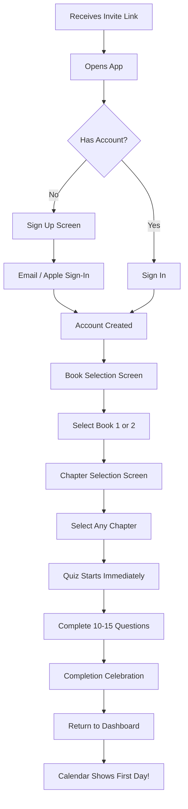
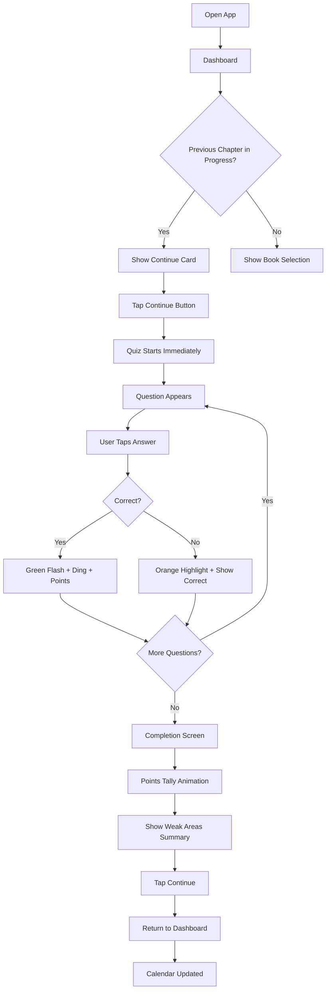
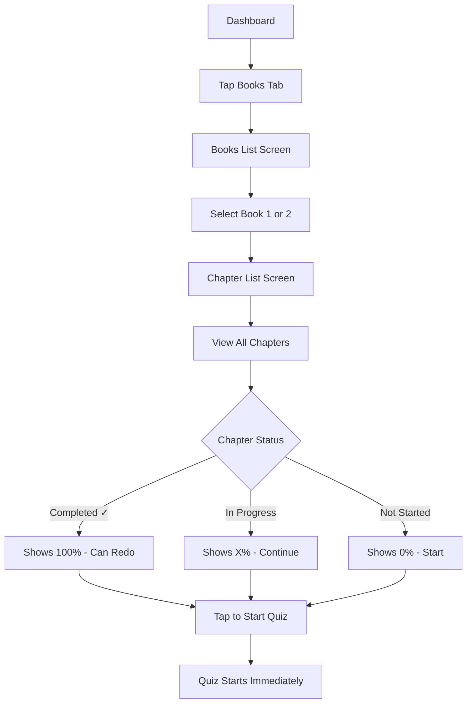
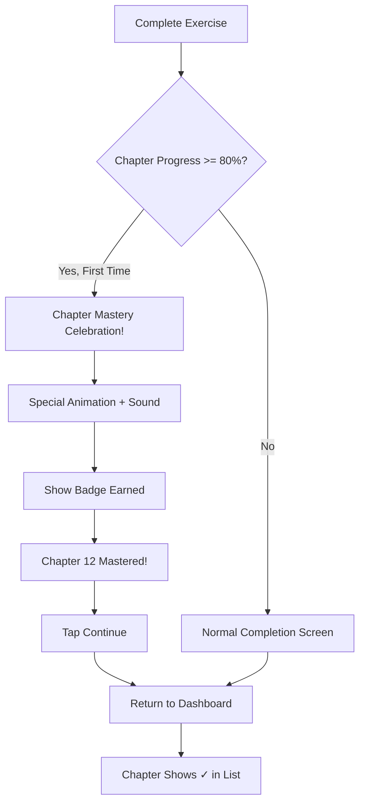

# UX Design Specification dangdai-app

**Author:** Maxime
**Date:** Sat Feb 14 2026

---

## Executive Summary

### Project Vision

A gamified mobile app enabling NTNU 當代中文課程 (Dangdai) alumni to continue their Chinese studies anywhere in the world. The app mirrors the exact curriculum structure - same vocabulary, grammar patterns, and chapter progression - that users already learned in Taiwan, delivered through a Duolingo-style mobile experience.

**Core Value Proposition:** "Continue your NTNU Chinese journey, anywhere in the world."

### Target Users

**Primary Users (MVP):** 5 friends who studied Chinese at NTNU Taiwan
- Familiar with Dangdai textbook structure and content
- Want to maintain Chinese skills after leaving Taiwan
- Seek short, engaging sessions (15+ minutes, 3x/week)
- Looking for familiar content that mirrors classroom experience

**Growth Target:** 100 NTNU alumni within 12 months

### Key Design Challenges

1. **Quiz Experience Flow** - Making AI-generated quizzes feel seamless and responsive despite 5-second LLM generation time. Clear loading feedback and smooth question transitions are essential.

2. **Progress Clarity Across Multiple Dimensions** - Users track chapter %, book progress, streaks, points, and quiz history. Must present without overwhelming while making "continue where I left off" instant.

3. **Chinese Character Display & Interaction** - Handling character/pinyin/meaning relationships clearly across question types. Mobile typography and readability for Chinese characters is critical.

4. **Motivation for Small User Group** - MVP gamification (streaks, points) must drive 3x/week engagement among 5 friends without Phase 2 social features.

### Design Opportunities

1. **Familiar Curriculum = Reduced Cognitive Load** - Users know Dangdai structure from NTNU. UX can leverage this familiarity - "pick up where you left off" feels like returning to class, not learning a new app.

2. **Micro-Session Optimization** - Design for 15-minute commute/break sessions. Quick launch → immediate quiz → visible progress → satisfying close.

3. **Celebration & Momentum** - Strong visual feedback for correct answers, chapter completion, and streak milestones creates emotional hooks that keep the friend group engaged.

## Core User Experience

### Defining Experience

The core experience is the **quiz interaction loop**: question → answer → immediate feedback → points reward. This is what users will do most frequently and must feel polished and satisfying.

**Core Loop:**
1. User sees question (character, pinyin, or meaning)
2. User selects/inputs answer
3. Instant feedback with sound + animation (correct/incorrect)
4. Points animate upward
5. Next question or completion celebration

### Platform Strategy

| Aspect | Decision |
|--------|----------|
| Framework | React Native + Expo |
| UI Library | Tamagui (performant, cross-platform styling) |
| Design Style | Playful like Duolingo, but simpler to implement |
| Connectivity | Online-only (LLM quiz generation requires internet) |
| Primary Input | Touch-based mobile interaction |

### Effortless Interactions

- **Continue learning** - One tap from dashboard to resume current chapter quiz
- **Answer questions** - Large, tappable answer options with clear touch feedback
- **Track progress** - Glanceable dashboard shows streak calendar + chapter progress without navigation

### Critical Success Moments

1. **First correct answer** - Sound + animation confirms "this works"
2. **Exercise completion** - Points visibly tally up with satisfying animation
3. **Calendar day filled** - GitHub-style grid shows today's activity, building streak visibility
4. **Chapter mastery** - Clear celebration when reaching 80%+ on chapter

### Experience Principles

1. **Playful but achievable** - Duolingo-inspired fun without over-engineering complexity
2. **Satisfying feedback loops** - Every correct answer rewards with sound + animation
3. **Visual progress is motivating** - GitHub-style activity calendar makes consistency visible
4. **Quick to value** - Minimal taps from launch to learning
5. **Familiar structure** - Dangdai curriculum structure users already know reduces cognitive load

## Desired Emotional Response

### Primary Emotional Goals

Users should feel these core emotions when using dangdai-app:

1. **Accomplished** - "I'm actually learning and making real progress with my Chinese"
2. **Nostalgic** - "This feels like being back in NTNU class with familiar content"
3. **Playful/Fun** - "This doesn't feel like studying, it's enjoyable"
4. **Motivated** - "I want to come back and do more"

**Share-worthy moment:** "This app is fun AND it uses our NTNU books!" - the combination of enjoyment + familiar curriculum is what makes users tell friends.

### Emotional Journey Mapping

| Stage | Desired Emotion |
|-------|-----------------|
| Opening app | Welcomed, ready to learn |
| During quiz | Engaged, playful, focused |
| Correct answer | Small burst of satisfaction |
| Wrong answer | Encouraged ("nice try"), not shamed |
| Session complete | Productive, accomplished |
| Viewing progress | Proud of consistency |
| Missed days | No guilt - focus on weekly/monthly totals |

### Micro-Emotions

**Prioritize:**
- Confidence over confusion (clear UI, familiar structure)
- Accomplishment over frustration (gentle feedback)
- Delight over mere satisfaction (sounds, animations)
- Encouragement over pressure (activity count vs streak guilt)

**Avoid:**
- Anxiety about breaking streaks
- Shame for wrong answers
- Guilt for missed days
- Overwhelm from too much information

### Design Implications

| Emotional Goal | UX Design Approach |
|----------------|-------------------|
| Accomplished | Points animation, chapter % progress, GitHub-style calendar |
| Nostalgic | NTNU Dangdai structure, familiar vocabulary/grammar |
| Playful/Fun | Sounds, animations, celebratory feedback |
| Motivated | Weekly/monthly activity count (not consecutive streaks) |
| Encouraged (on failure) | Gentle wrong answer feedback, no red X shame |
| Productive (post-session) | Clear summary of what was accomplished |

### Emotional Design Principles

1. **Celebrate effort, not perfection** - Activity frequency matters more than perfect streaks
2. **Gentle failure** - Wrong answers encourage retry, not discourage
3. **Nostalgia as comfort** - Familiar NTNU structure reduces anxiety
4. **Fun is productive** - Playful design doesn't diminish learning value
5. **No guilt mechanics** - Weekly/monthly counts replace streak pressure

## UX Pattern Analysis & Inspiration

### Inspiring Products Analysis

#### Duolingo
**What they do well:**
- Quiz flow with smooth transitions between questions
- Immediate answer feedback with satisfying sounds/animations
- Clear progress visualization (XP, levels, completion %)
- "Words you struggled with" summary after lessons
- Sound design that celebrates without being annoying
- Bite-sized lesson structure (5-10 min sessions)

**What to avoid:**
- Aggressive streak guilt messaging
- Excessive notifications/nagging
- Hearts/lives system that punishes mistakes
- Heavy upsell pressure for premium

#### Noji (formerly Noji Pro)
**What they do well:**
- Clean, calming visual aesthetic
- Satisfying micro-interactions and animations
- Simple, clear data visualization
- Non-judgmental tracking approach
- Minimal UI that doesn't overwhelm

### Transferable UX Patterns

**From Duolingo:**
| Pattern | Application to dangdai-app |
|---------|---------------------------|
| Quiz flow | Smooth question → answer → feedback → next loop |
| Answer feedback | Sound + animation for correct/incorrect |
| Progress visualization | Chapter %, points, activity calendar |
| Weak area summary | "You struggled with 會 vs 可以" post-quiz |
| Lesson structure | 10-15 question exercises, chapter-based |

**From Noji:**
| Pattern | Application to dangdai-app |
|---------|---------------------------|
| Clean aesthetic | Playful but not cluttered |
| Micro-interactions | Subtle, satisfying animations throughout |
| Non-judgmental tracking | Weekly/monthly counts, no guilt |
| Simple visualization | GitHub-style calendar, clear progress bars |

### Anti-Patterns to Avoid

1. **Streak guilt** - No "You'll lose your streak!" pressure messaging
2. **Punishment mechanics** - No hearts/lives that limit learning
3. **Notification spam** - Minimal, respectful reminders only (Phase 2)
4. **Cluttered UI** - Keep screens focused, avoid feature overload
5. **Shame on failure** - Wrong answers encourage, not discourage

### Design Inspiration Strategy

**Adopt Directly:**
- Duolingo quiz flow (question → feedback → next)
- Duolingo sound design approach (celebratory, not annoying)
- Duolingo weak area summary
- Noji clean aesthetic and micro-interactions
- Noji non-judgmental tracking philosophy

**Adapt for dangdai-app:**
- Duolingo progress → Simplify to chapter % + GitHub calendar
- Duolingo lesson structure → Map to Dangdai chapters/vocabulary
- Noji minimal UI → Add playfulness while keeping clarity

**Explicitly Avoid:**
- Duolingo streak guilt mechanics
- Duolingo hearts/lives system
- Duolingo aggressive notifications
- Over-gamification that distracts from learning

## Design System Foundation

### Design System Choice

**Primary UI Library:** Tamagui

Tamagui provides a performant, themeable foundation for React Native + Expo that aligns with dangdai-app's need for a playful, custom aesthetic with smooth animations.

### Rationale for Selection

| Requirement | How Tamagui Addresses It |
|-------------|-------------------------|
| Playful aesthetic | Fully themeable, not locked to Material Design |
| Performance | Compiles to native, optimized for animations |
| Expo compatibility | First-class Expo support |
| Custom look | Strong theming system for brand customization |
| Animation support | Works with @tamagui/animations for quiz feedback |

### Implementation Approach

**Foundation Layer:**
- Tamagui core components (Button, Card, Text, Stack, etc.)
- Custom theme with playful color palette
- Typography scale optimized for Chinese characters

**Custom Components (to build):**
- Quiz question/answer cards
- Progress bar with animation
- Points counter with tally animation
- GitHub-style activity calendar
- Correct/incorrect feedback overlays

**Animation Strategy:**
- Tamagui animations for UI transitions
- React Native Reanimated for complex quiz feedback
- Sound integration via expo-av

### Customization Strategy

**Theme Customization:**
- Define playful color tokens (primary, success, error, etc.)
- Create custom spacing and radius for rounded, friendly feel
- Typography tokens for Latin and Chinese character display

**Component Customization:**
- Extend Tamagui primitives for quiz-specific components
- Build reusable feedback patterns (correct/incorrect states)
- Create consistent touch targets for mobile quiz interaction

## Defining Experience

### Core Interaction

**One-sentence description:** "A cool app that feels like a game but to continue learning Taiwan Chinese in the NTNU books where you left it."

**Defining experience:** Complete a workbook-style exercise and see your progress fill up the calendar.

The satisfaction comes at **exercise completion**, not individual questions. Individual correct answers are small wins leading to the big payoff.

### User Mental Model

**Background from NTNU:**
- Users learned through: class with teacher + textbook → workbook exercises
- The app serves as a **digital workbook** with gamification
- Familiar structure reduces learning curve

**User expectations:**
- Exercise = set of 10-15 related questions (like a workbook page)
- Completion = satisfying moment of accomplishment
- Progress = visible, cumulative, non-judgmental

### Success Criteria

| Criteria | What Success Looks Like |
|----------|------------------------|
| Exercise completion | Clear celebration moment with sound + animation |
| Progress visibility | Calendar fills up, points tally animates |
| Session satisfaction | User feels productive after 15 minutes |
| Return motivation | "I want to fill more calendar squares" |

### Pattern Analysis

**Established Patterns (users already know):**
- Workbook exercise structure (from NTNU experience)
- Quiz question/answer format (familiar from any learning app)
- Progress tracking (familiar from fitness/habit apps)

**Our Unique Twist:**
- Gamified workbook (sounds, animations, points on completion)
- NTNU-specific content (nostalgia + curriculum familiarity)
- Guilt-free progress tracking (weekly/monthly counts, not streaks)

### Experience Mechanics

**1. Initiation:**
- User taps "Continue" or selects chapter
- Exercise loads (10-15 questions from chapter content)

**2. Interaction:**
- Question appears (character/pinyin/meaning)
- User taps answer from multiple choice
- Immediate feedback: sound + visual (correct = green + ding, incorrect = gentle orange + encouraging)
- Next question auto-advances

**3. Feedback (per question):**
- Correct: satisfying sound, brief green flash, small point increment
- Incorrect: gentle sound, orange highlight, show correct answer, "nice try" energy

**4. Completion (the big moment):**
- All questions answered → celebration screen
- Points tally up with animation + sound
- "You struggled with: 會 vs 可以" summary
- Calendar square fills in for today
- "Exercise complete! +85 points"

## Visual Design Foundation

### Color System

**Primary Palette:**

| Token | Color | Hex | Usage |
|-------|-------|-----|-------|
| Primary | Teal/Cyan | `#06B6D4` | Main actions, buttons, highlights |
| Primary Dark | Deep Teal | `#0891B2` | Pressed states, emphasis |
| Secondary | Warm Orange | `#F97316` | Accents, points, celebrations |

**Semantic Colors:**

| Token | Color | Hex | Usage |
|-------|-------|-----|-------|
| Success | Soft Green | `#22C55E` | Correct answers, completion |
| Error | Gentle Orange | `#FB923C` | Wrong answers (encouraging, not harsh) |
| Warning | Amber | `#FBBF24` | Alerts, attention |
| Background | Off-white | `#FAFAF9` | Main background |
| Surface | White | `#FFFFFF` | Cards, elevated surfaces |
| Text Primary | Dark Gray | `#1C1917` | Main text |
| Text Secondary | Medium Gray | `#78716C` | Secondary text |

**Color Rationale:**
- Teal primary = fresh, modern, calming but energetic
- Orange accents = celebratory, warm (points, rewards)
- Gentle orange for errors = encouraging, not punishing (aligns with emotional goals)
- Soft green for success = satisfying without being harsh

### Typography System

**Font Families:**

| Type | Font | Fallback |
|------|------|----------|
| Latin (UI) | Inter | SF Pro, system-ui |
| Chinese | System Default | PingFang SC (iOS), Noto Sans CJK (Android) |

**Type Scale:**

| Level | Size | Weight | Usage |
|-------|------|--------|-------|
| Display | 32px | Bold | Celebration screens |
| H1 | 24px | Semibold | Screen titles |
| H2 | 20px | Semibold | Section headers |
| Body Large | 18px | Regular | Quiz questions, Chinese characters |
| Body | 16px | Regular | General text |
| Caption | 14px | Regular | Secondary info, labels |
| Small | 12px | Medium | Badges, metadata |

**Chinese Character Guidelines:**
- Minimum 18-20px for quiz content
- Adequate line height (1.5) for character clarity
- Consider character weight for stroke visibility

### Spacing & Layout Foundation

**Base Unit:** 4px

**Spacing Scale:**

| Token | Value | Usage |
|-------|-------|-------|
| xs | 4px | Tight spacing, inline elements |
| sm | 8px | Related elements |
| md | 16px | Standard spacing |
| lg | 24px | Section spacing |
| xl | 32px | Large gaps |
| 2xl | 48px | Screen padding, major sections |

**Border Radius:**

| Element | Radius |
|---------|--------|
| Buttons, Cards | 12px |
| Small elements | 8px |
| Icons, Avatars | Full (50%) |

**Layout Principles:**
1. **Generous touch targets** - Minimum 48px for tappable elements
2. **Breathing room** - Cards and quiz options have ample padding
3. **Clear hierarchy** - Spacing increases between less related elements
4. **Mobile-first** - Designed for one-handed use

### Accessibility Considerations

- All text meets WCAG AA contrast ratios (4.5:1 minimum)
- Large Chinese characters for readability (18px+ for quiz content)
- Color is never the only indicator (icons + color for correct/incorrect)
- Touch targets minimum 48x48px
- Support for system font scaling

## Design Direction Decision

### Design Directions Explored

Six design direction mockups were created exploring different visual approaches:

1. **Dashboard (Clean)** - Minimal, Noji-inspired with progress ring and card-based layout
2. **Dashboard (Vibrant)** - Bold teal header with stats, more Duolingo-like energy
3. **Quiz Screen** - Question/answer flow with large Chinese characters and 2x2 answer grid
4. **Completion Screen** - Celebration moment with points tally, accuracy stats, and review summary
5. **Progress Focus** - Monthly calendar view with book progress cards
6. **Chapter Selection** - Chapter list with progress states and open navigation

Interactive mockups available at: `_bmad-output/planning-artifacts/ux-design-directions.html`

### Chosen Direction

**Approach:** Hybrid combining elements from multiple directions

**Key Design Decisions:**
- Clean card-based layout (Direction 1) for dashboard clarity
- Vibrant gamification elements (Direction 2) for engagement
- Large-character quiz cards (Direction 3) for readability
- Full-screen celebration (Direction 4) for completion satisfaction
- Monthly calendar with "X days this month" (Direction 5) for guilt-free tracking
- Open chapter navigation (Direction 6) for flexibility

**Theme Support:** Both light and dark mode supported
- Light mode: Off-white background, white cards, teal accents
- Dark mode: Dark gray backgrounds, elevated dark cards, adjusted accent colors

### Design Rationale

| Decision | Rationale |
|----------|-----------|
| Clean + Vibrant hybrid | Balance between Noji calm and Duolingo fun |
| Large Chinese characters | Critical for readability and learning |
| Full-screen completion | Maximizes celebration moment impact |
| Monthly calendar (not streak) | Aligns with "no guilt" emotional goal |
| Dark mode support | Modern app expectation, reduces eye strain |
| Card-based layout | Clear visual hierarchy, familiar pattern |

### Implementation Approach

**Phase 1 (MVP):**
- Implement core screens: Dashboard, Quiz, Completion, Chapter Select
- Light mode first, dark mode as fast-follow
- Focus on quiz feedback animations and sounds

**Component Priority:**
1. Quiz question/answer cards with feedback states
2. Progress ring and progress bars
3. GitHub-style activity calendar
4. Points counter with animation
5. Completion celebration screen

**Theme Implementation:**
- Use Tamagui theme tokens for all colors
- CSS variables approach for easy theme switching
- Respect system preference with manual override option

## User Journey Flows

### Journey 1: First-Time User (Onboarding)

**Goal:** Get new user from signup to first quiz completion as fast as possible.

**Flow Summary:** Signup → Book Selection → Chapter Selection → First Quiz → Completion Celebration

**Key Design Decisions:**
- No tutorial/intro - get to learning immediately
- Book/chapter selection is required (no default)
- All chapters accessible from day one
- First completion = first calendar square filled

**Success Moment:** "Day 1 started! +X points" with calendar visual

---

### Journey 2: Daily Quiz Session (Core Loop)

**Goal:** Minimal friction from app open to learning.

**Flow Summary:** Open App → Dashboard → Continue → Quiz → Completion → Dashboard

**Key Design Decisions:**
- One tap from dashboard to quiz (no confirmation screens)
- Auto-advance between questions after feedback
- Completion screen shows: points, accuracy, weak areas
- Dashboard updates immediately with new calendar state

**Timing:**
- Question feedback: ~1 second display
- Completion animation: ~2-3 seconds
- Total session: ~10-15 minutes for 10-15 questions

---

### Journey 3: Chapter Navigation

**Goal:** Allow flexible navigation to any chapter in any book.

**Flow Summary:** Dashboard → Books → Select Book → Chapters → Select Any Chapter → Quiz

**Key Design Decisions:**
- All chapters visible and accessible (no locks)
- Clear visual states: Completed (✓), In Progress (%), Not Started
- Can redo completed chapters anytime
- Back navigation always available

---

### Journey 4: Chapter Completion (Mastery)

**Goal:** Celebrate chapter mastery when reaching 80%+.

**Key Design Decisions:**
- 80% threshold triggers mastery celebration
- Extra celebration for first-time mastery (not on redo)
- Badge/achievement earned
- Return to dashboard (no auto-prompt for next chapter)

---

### Journey Patterns

**Navigation Patterns:**

| Pattern | Usage |
|---------|-------|
| One-tap action | Continue button → Quiz starts |
| Back navigation | Always available, returns to previous screen |
| Tab navigation | Home, Books, Progress, Settings |
| Open access | All content accessible, no gates |

**Feedback Patterns:**

| Pattern | Usage |
|---------|-------|
| Immediate feedback | <100ms response to tap |
| Sound + Visual | Correct/incorrect always paired |
| Progress indication | Bar updates after each question |
| Celebration | Full-screen for completion |

**Error Handling:**

| Scenario | Recovery |
|----------|----------|
| Network error during quiz | Save progress locally, retry on reconnect |
| App crash mid-quiz | Resume from last saved question |
| Quiz generation fails | Show friendly error, offer retry |

### Flow Optimization Principles

1. **Minimize taps to value** - One tap from dashboard to learning
2. **No confirmation dialogs** - Trust user intent, allow easy undo
3. **Progressive disclosure** - Show only relevant info at each step
4. **Always show progress** - User always knows where they are
5. **Graceful degradation** - Handle errors without losing progress
6. **Celebrate milestones** - Mark achievements clearly

## Component Strategy

### Design System Components (from Tamagui)

**Foundation Components (use as-is):**

| Component | Usage |
|-----------|-------|
| Button | Navigation, CTAs |
| Text | All typography |
| Stack (XStack, YStack) | Layout structure |
| Card | Container for content |
| Sheet | Bottom sheets, modals |
| Input | Text input fields |
| Tabs | Bottom navigation |
| Separator | Visual dividers |

**Extended Components (customize Tamagui base):**

| Component | Base | Customization |
|-----------|------|---------------|
| AnswerButton | Button | Add correct/incorrect states, larger touch target |
| ProgressBar | Progress | Add animation, custom colors |
| NavTab | Tabs | Custom icons, active states |

### Custom Components

#### QuizQuestionCard

**Purpose:** Display quiz question with character, pinyin, or meaning prompt

**Anatomy:**
- Question type label ("What does this mean?")
- Primary content (large Chinese character, pinyin, or English)
- Secondary content (pinyin below character if applicable)
- Container with rounded corners, elevation

**States:**
- Default (awaiting answer)
- Correct (green border, success indicator)
- Incorrect (orange border, shows correct answer)

**Variants:**
- Character display (large 72px character)
- Pinyin display (medium 24px pinyin)
- Meaning display (medium 20px English)

---

#### AnswerOptionGrid

**Purpose:** Display answer options in flexible layouts

**Variants:**

| Variant | Layout | Use Case |
|---------|--------|----------|
| Grid 2x2 | 4 options in grid | Most common - vocabulary |
| List | 2-4 vertical options | Longer answer text |
| TextInput | Single input field | User types answer |

**States (per option):**
- Default (neutral border)
- Hover/Press (primary color border)
- Selected (primary fill)
- Correct (green border + checkmark)
- Incorrect (orange border)
- Disabled (dimmed, after answer)

**Accessibility:**
- Minimum 48x48px touch targets
- Focus states for keyboard navigation
- ARIA labels for screen readers

---

#### TextInputAnswer

**Purpose:** Allow user to type answer (pinyin, character, or meaning)

**Anatomy:**
- Input field with placeholder
- Submit button
- Character counter (if applicable)

**States:**
- Empty (placeholder visible)
- Focused (primary border)
- Filled (user input shown)
- Correct (green border + checkmark)
- Incorrect (orange border + show correct)

**Behavior:**
- Auto-submit on Enter key
- Show pinyin keyboard hints on mobile (if typing pinyin)
- Support Chinese character input

---

#### ActivityCalendar

**Purpose:** GitHub-style calendar showing learning activity

**Anatomy:**
- Month/year header with navigation arrows
- Day-of-week labels (S M T W T F S)
- Day grid (colored by activity)
- "X days this month" counter

**States (per day):**
- Empty (no activity) - gray
- Active (completed exercise) - primary color
- Today (current day) - highlighted border
- Future (upcoming) - very light/disabled

**Behavior:**
- Swipe/arrow to navigate months
- Tap day to see details (Phase 2)
- Color intensity based on activity count (optional)

**Variants:**
- Week view (compact, dashboard)
- Month view (full, progress screen)

---

#### PointsCounter

**Purpose:** Display and animate points earned

**Anatomy:**
- Points value (large number)
- Points label
- Optional: flame/trophy icon

**Animation:**
- Count-up animation on points earned
- Satisfying "tick tick tick" timing
- Subtle scale bounce at end

**Variants:**
- Inline (small, header badge)
- Celebration (large, completion screen)

---

#### CompletionScreen

**Purpose:** Celebrate exercise completion

**Anatomy:**
- Celebration icon/emoji
- "Exercise Complete!" title
- Points earned (animated)
- Stats row (correct count, accuracy %)
- Weak areas summary card
- Continue button

**Animation Sequence:**
1. Screen slides up
2. Trophy/emoji bounces in
3. Points count up with sound
4. Stats fade in
5. Continue button appears

**Variants:**
- Normal completion
- Chapter mastery (extra celebration, badge)

---

#### ChapterListItem

**Purpose:** Display chapter in list with progress

**Anatomy:**
- Chapter number badge
- Chapter name (English)
- Chapter name (Chinese)
- Progress indicator (% or checkmark)

**States:**
- Not started (gray badge, 0%)
- In progress (primary badge, X%)
- Completed (green badge, checkmark)

**Behavior:**
- Tap to start/continue quiz
- All chapters tappable (no locks)

---

#### BookCard

**Purpose:** Display book with overall progress

**Anatomy:**
- Book cover (colored, with Chinese + number)
- Book title
- Progress summary (X/15 chapters)
- Progress bar

**Behavior:**
- Tap to view chapters

---

#### FeedbackOverlay

**Purpose:** Show correct/incorrect feedback after answer

**Anatomy:**
- Semi-transparent overlay
- Icon (checkmark or X)
- Optional: correct answer display

**Animation:**
- Quick fade in (100ms)
- Hold (500ms)
- Auto-dismiss and advance

**Sound Integration:**
- Correct: satisfying "ding"
- Incorrect: gentle "bonk" (not harsh)

---

### Component Implementation Strategy

**Build Order (by user journey priority):**

**Phase 1 - Core Quiz Experience:**
1. QuizQuestionCard
2. AnswerOptionGrid (2x2 + list variants)
3. TextInputAnswer
4. FeedbackOverlay
5. ProgressBar (animated)
6. CompletionScreen

**Phase 2 - Navigation & Progress:**
7. ChapterListItem
8. BookCard
9. ActivityCalendar (week view)
10. PointsCounter

**Phase 3 - Enhanced Experience:**
11. ActivityCalendar (full month, scrollable)
12. Chapter mastery celebration variant
13. Sound integration across components

### Implementation Approach

**Tamagui Integration:**
- Use Tamagui's `styled()` to extend base components
- Leverage theme tokens for all colors
- Use `@tamagui/animations` for micro-interactions

**Animation Library:**
- React Native Reanimated for complex animations
- Tamagui animations for simple transitions

**Sound Integration:**
- expo-av for audio playback
- Preload sounds on app start
- Sound manager for volume/mute control

**Accessibility:**
- All interactive elements have ARIA labels
- Minimum 48px touch targets
- Support VoiceOver/TalkBack
- Respect reduced motion preference

## UX Consistency Patterns

### Feedback Patterns

#### Answer Feedback

| State | Visual | Sound | Duration |
|-------|--------|-------|----------|
| Correct | Green border, checkmark icon, card highlight | Satisfying "ding" | 1 second |
| Incorrect | Orange border, show correct answer | Gentle "bonk" | 1 second |

**Behavior:**
- Feedback appears immediately on tap (<100ms)
- Auto-advance to next question after 1 second
- User cannot tap during feedback animation
- Points increment visible on correct answer

#### Completion Feedback

| State | Visual | Sound |
|-------|--------|-------|
| Exercise Complete | Full-screen celebration, points tally | Celebratory chime |
| Chapter Mastery (80%+) | Extra celebration, badge earned | Special achievement sound |

**Animation Sequence:**
1. Screen transition (slide up)
2. Emoji/trophy bounce in
3. Points count up (with ticking sound)
4. Stats fade in
5. Continue button appears

---

### Button Hierarchy

| Level | Style | Usage | Example |
|-------|-------|-------|---------|
| Primary | Filled, primary color | Main action per screen | "Continue", "Start Quiz" |
| Secondary | Outlined, primary color | Alternative action | "View All Chapters" |
| Tertiary | Text only, primary color | Minor action | "Skip", "Cancel" |
| Destructive | Outlined, error color | Dangerous action | "Delete Progress" |

**Button States:**
- Default → Hover/Press (darken 10%) → Disabled (50% opacity)
- Minimum height: 48px
- Minimum width: 120px for primary buttons
- Full-width on mobile for primary CTAs

---

### Navigation Patterns

#### Tab Navigation

| Tab | Icon | Label |
|-----|------|-------|
| Home | House | Home |
| Books | Book | Books |
| Progress | Chart | Progress |
| Settings | Gear | Settings |

**Behavior:**
- Active tab: Primary color icon + label
- Inactive tab: Gray icon + label
- Tap switches immediately (no animation delay)
- Badge on tab for notifications (Phase 2)

#### Back Navigation

| Context | Behavior |
|---------|----------|
| Within flow | Back arrow in header, returns to previous screen |
| Quiz in progress | X button, triggers "Are you sure?" dialog |
| Root screens (tabs) | No back button |

#### Quiz Exit Confirmation

**Trigger:** User taps X during active quiz

**Dialog:**
- Title: "Leave exercise?"
- Message: "Your progress will be saved."
- Primary action: "Keep Learning" (stay)
- Secondary action: "Leave" (exit and save)

**Behavior:**
- Progress saves automatically
- User returns to dashboard
- Can resume from where they left off

---

### Loading & Empty States

#### Quiz Generation Loading

**Trigger:** Starting new quiz (LLM generating questions ~5 seconds)

**Display:**
- Fun animation (rotating Chinese character or bouncing mascot)
- Rotating tips about Chinese learning:
  - "Did you know? 你好 literally means 'you good'!"
  - "Tip: Practice writing characters by hand too!"
  - "Fun fact: Mandarin has 4 tones (plus neutral)!"
- Progress indicator (spinner or bar)

**Behavior:**
- Tips rotate every 2 seconds
- Cancel button available (returns to previous screen)
- Graceful error if generation fails

#### Empty States

| Screen | Empty State |
|--------|-------------|
| Dashboard (new user) | "Welcome! Choose a book to start learning" + Book selection CTA |
| Progress (no activity) | "Start your first exercise to see progress here" + Start CTA |
| Chapter (0%) | "Ready to begin? Tap to start your first exercise" |

**Design:**
- Friendly illustration or icon
- Clear message explaining what to do
- Single CTA button

#### Error States

| Error Type | Display | Recovery |
|------------|---------|----------|
| Network error | "Oops! Check your connection" + Retry button | Tap to retry |
| Quiz generation failed | "Couldn't load questions" + Retry button | Tap to retry |
| General error | "Something went wrong" + Go Home button | Return to dashboard |

**Tone:** Friendly, not technical. Never blame the user.

---

### Sound Patterns

#### Sound Events

| Event | Sound | Character |
|-------|-------|-----------|
| Correct answer | "Ding" | Bright, satisfying, short |
| Incorrect answer | "Bonk" | Soft, gentle, not harsh |
| Exercise complete | "Celebration chime" | Uplifting, rewarding |
| Chapter mastery | "Achievement fanfare" | Special, memorable |
| Points counting | "Tick tick tick" | Fast, satisfying tally |
| Button tap | Subtle haptic | Tactile feedback only |

#### Sound Settings

- Master toggle: Sounds on/off
- Respect device silent mode
- No sounds for navigation (only meaningful moments)
- Haptic feedback independent of sound setting

---

### Form Patterns

#### Text Input (Quiz Answer)

**States:**
- Empty: Placeholder text ("Type your answer...")
- Focused: Primary color border, keyboard open
- Filled: User text visible
- Submitting: Brief loading indicator
- Correct: Green border + checkmark
- Incorrect: Orange border + show correct answer

**Behavior:**
- Submit on Enter key
- Submit button also available
- Auto-capitalize off for pinyin input
- Support Chinese keyboard for character input

#### Validation

- Validate on submit (not on blur)
- Inline error message below input
- Don't clear input on error (let user correct)

---

### Animation Patterns

#### Timing Guidelines

| Animation Type | Duration | Easing |
|----------------|----------|--------|
| Micro-interaction (button) | 100-150ms | ease-out |
| Feedback (correct/incorrect) | 200ms in, 1000ms hold | ease-out |
| Screen transition | 300ms | ease-in-out |
| Celebration | 500-800ms | spring |
| Points counter | 1500-2000ms | linear |

#### Reduced Motion

- Respect `prefers-reduced-motion` setting
- Disable animations but keep feedback (color changes)
- Sound feedback still works
- Instant transitions instead of animated

---

### Consistency Rules

1. **One primary action per screen** - Never compete for attention
2. **Immediate feedback** - Every tap gets visual/audio response
3. **Predictable navigation** - Same patterns everywhere
4. **Forgiving interactions** - Confirm destructive actions, allow undo
5. **Celebration over shame** - Emphasize success, gentle on failure
6. **Sound enhances, never annoys** - Meaningful moments only

## Responsive Design & Accessibility

### Responsive Strategy

**Platform Focus:** Mobile phones only (iOS and Android)

**Supported Devices:**
- iPhone SE (375px) to iPhone Pro Max (430px)
- Android phones (360px - 412px typical)
- No tablet optimization (scaled phone UI acceptable)

**Orientation:** Portrait only
- Lock orientation to portrait
- Simplifies layout and quiz interaction
- Consistent with learning app conventions (Duolingo, etc.)

### Screen Size Adaptations

| Screen Width | Adaptations |
|--------------|-------------|
| Small (< 375px) | Tighter spacing, smaller fonts (minimum readable) |
| Medium (375-400px) | Default design, standard spacing |
| Large (> 400px) | Slightly more breathing room, larger touch targets |

**Key Adaptation Points:**
- Quiz answer grid: Fixed 2x2, but padding adjusts
- Chinese characters: Maintain 72px minimum for readability
- Bottom navigation: Fixed height, icons scale slightly
- Cards: Horizontal margins adjust (16px small, 20px large)

### Layout Principles

**Fixed Elements:**
- Bottom tab bar (always visible except during quiz)
- Status bar area (respected via safe area)
- Quiz progress bar (fixed at top during quiz)

**Scrollable Content:**
- Dashboard cards
- Chapter lists
- Progress calendar (month view)

**Safe Areas:**
- Respect notch/dynamic island on iPhone
- Respect Android navigation bar
- Use `SafeAreaView` consistently

### Accessibility Approach

**Basic Accessibility (Good Practices):**

| Category | Implementation |
|----------|---------------|
| Touch Targets | Minimum 48x48px for all interactive elements |
| Color Contrast | Meet 4.5:1 ratio for text readability |
| Font Sizing | Support dynamic type / system font scaling |
| Feedback | Visual + audio (never color alone) |
| Screen Reader | Basic labels for key interactive elements |

**Not in Scope (MVP):**
- Formal WCAG AA/AAA compliance
- Full VoiceOver/TalkBack optimization
- High contrast mode
- Reduced motion (nice to have, not required)

### Chinese Character Accessibility

**Specific Considerations for Chinese Learning:**

| Consideration | Implementation |
|---------------|---------------|
| Character Size | 72px for quiz display (large, clear strokes) |
| Stroke Clarity | Adequate font weight for thin strokes |
| Pinyin Display | 20px minimum, clear tone marks |
| Character + Pinyin | Sufficient spacing between |

### Testing Strategy

**Device Testing:**
- iPhone SE (smallest common iOS)
- iPhone 14/15 (standard size)
- iPhone Pro Max (largest)
- Popular Android (Pixel, Samsung mid-range)

**Testing Checklist:**
- [ ] All touch targets reachable with thumb
- [ ] Text readable without zooming
- [ ] Quiz answers tappable without mis-taps
- [ ] Chinese characters clear at all sizes
- [ ] No content cut off by notch/safe areas
- [ ] Sounds play correctly on both platforms

### Implementation Guidelines

**React Native Specifics:**
- Lock to portrait: `expo.orientation: "portrait"`
- Use `SafeAreaView` from `react-native-safe-area-context`
- Check device width with `Dimensions.get('window')`
- Define `isSmallDevice = width < 375` for conditional styling

**Tamagui Responsive:**
- Use Tamagui's responsive props where needed
- Define size tokens for small/medium/large
- Keep breakpoints simple (just small vs normal)

**Font Scaling:**
- Allow system font scaling up to 1.2x
- Test UI doesn't break at larger sizes
- Consider max font size for critical UI
